# Apex C2 Framework — Architecture & Data Flow Diagrams

This document provides detailed architecture diagrams and Data Flow Diagrams (DFDs) for the Apex C2 framework. All diagrams use Mermaid syntax compatible with GitHub Markdown rendering. The DFD notation follows Microsoft Threat Modeling Tool conventions with processes, data stores, data flows, external entities, and trust boundaries.

---

## Table of Contents

- [System Context Diagram - DFD Level 0](#system-context-diagram---dfd-level-0)
- [Component Architecture - DFD Level 1](#component-architecture---dfd-level-1)
- [Task Execution Sequence](#task-execution-sequence)
- [Agent Communication Sequence](#agent-communication-sequence)
- [Authentication Flow](#authentication-flow)
- [Payload Generation Flow](#payload-generation-flow)
- [BOF Execution Flow](#bof-execution-flow)
- [Agent Internal Architecture](#agent-internal-architecture)
- [Network Topology](#network-topology)
- [Database Entity Relationship](#database-entity-relationship)
- [Trust Boundaries](#trust-boundaries)
- [Data Store Inventory](#data-store-inventory)
- [Process Inventory](#process-inventory)
- [External Entity Inventory](#external-entity-inventory)
- [Data Flow Inventory](#data-flow-inventory)
- [STRIDE Threat Mapping](#stride-threat-mapping)
- [Microsoft Threat Modeling Tool Elements](#microsoft-threat-modeling-tool-elements)

---

## System Context Diagram - DFD Level 0

Highest-level view showing the Apex system and all external entities.

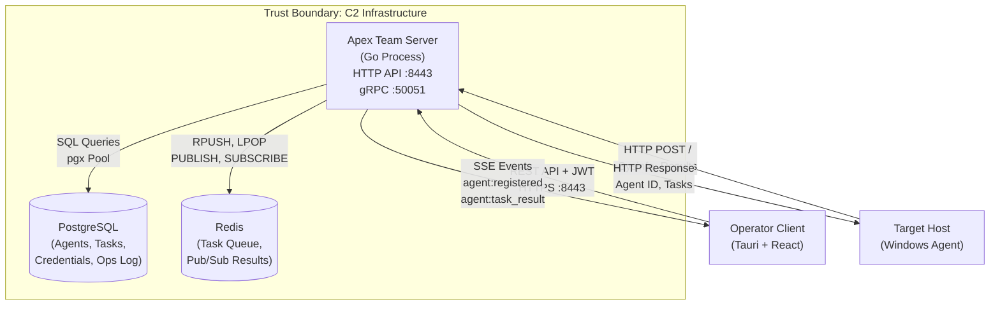

---

## Component Architecture - DFD Level 1

Internal decomposition of the Apex Team Server into processes and data stores.

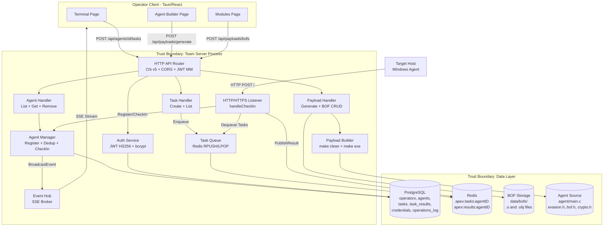

---

## Task Execution Sequence

End-to-end flow from operator command to result display.

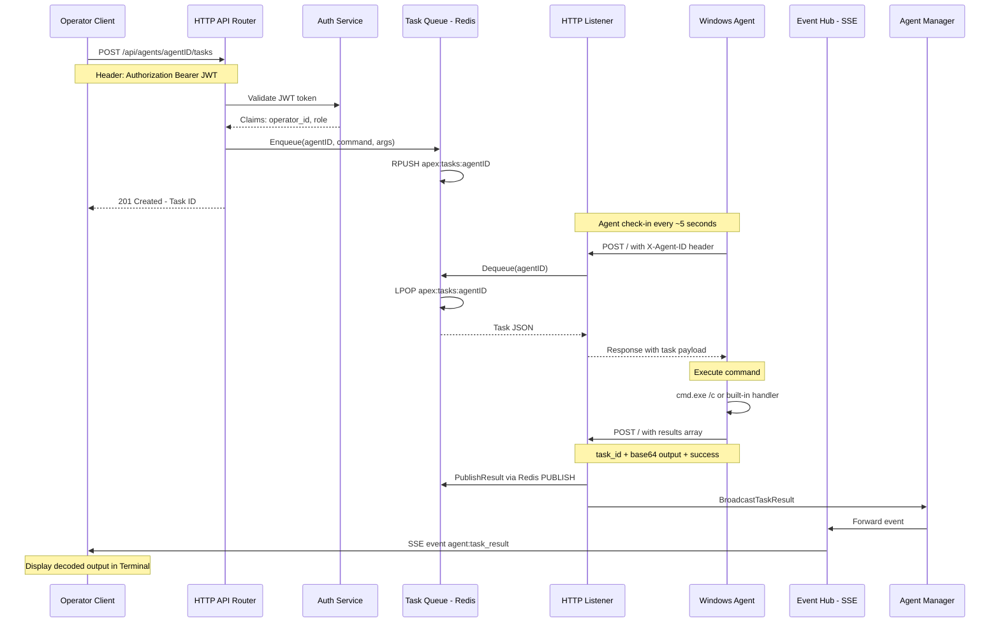

---

## Agent Communication Sequence

Registration and beacon lifecycle.

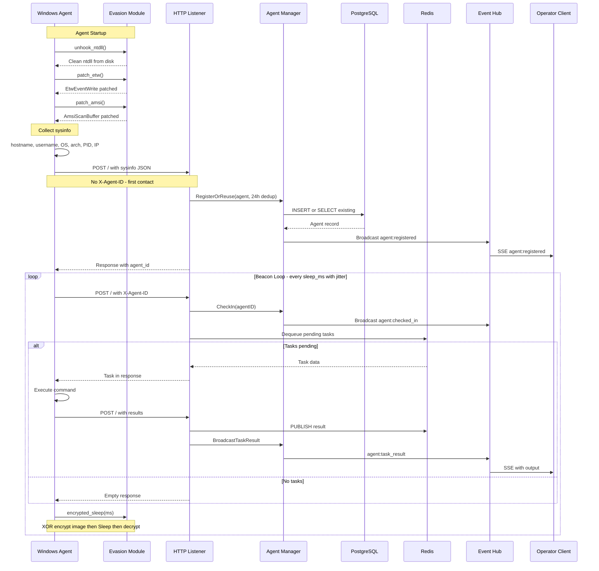

---

## Authentication Flow

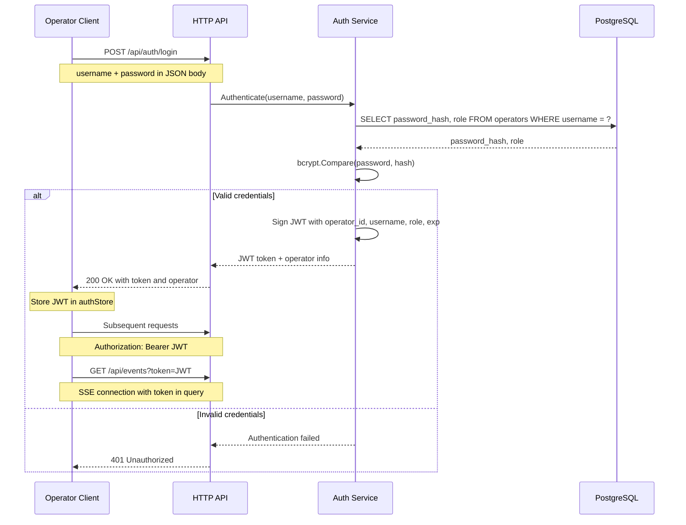

---

## Payload Generation Flow

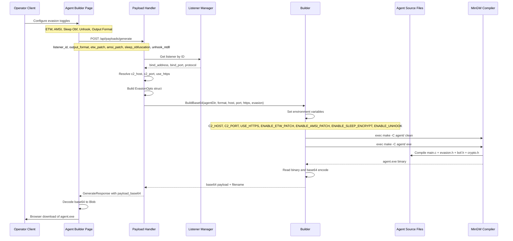

---

## BOF Execution Flow

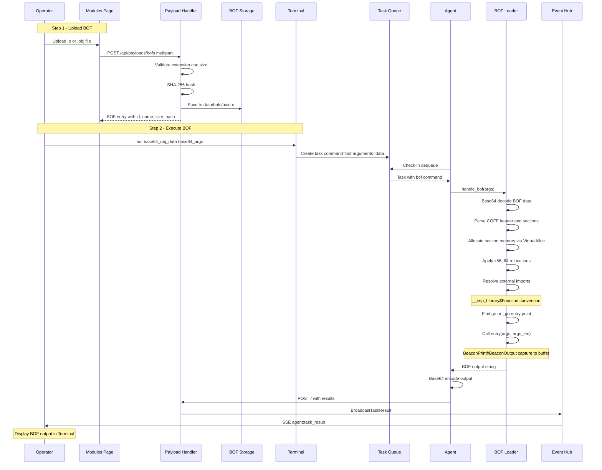

---

## Agent Internal Architecture

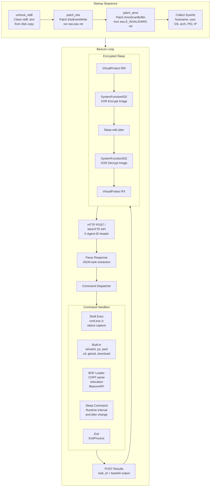

---

## Network Topology

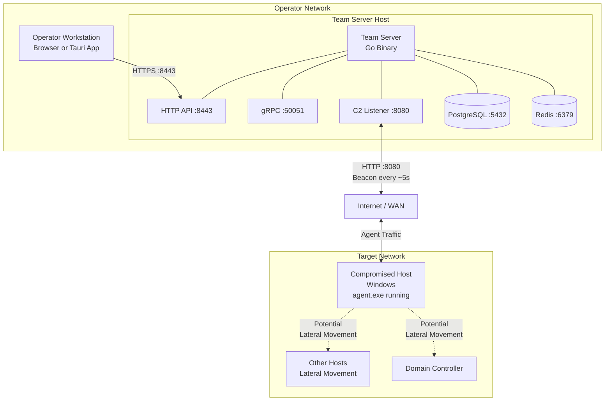

---

## Database Entity Relationship

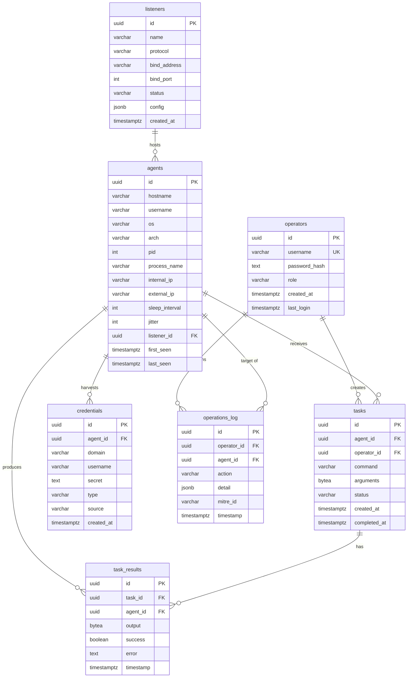

---

## SSE Event Flow

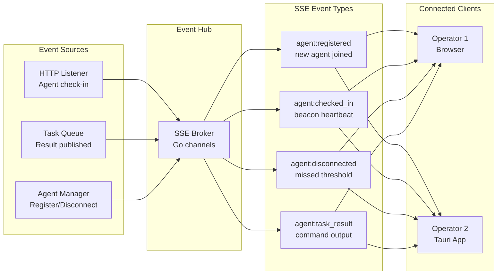

---

## Evasion Techniques Diagram

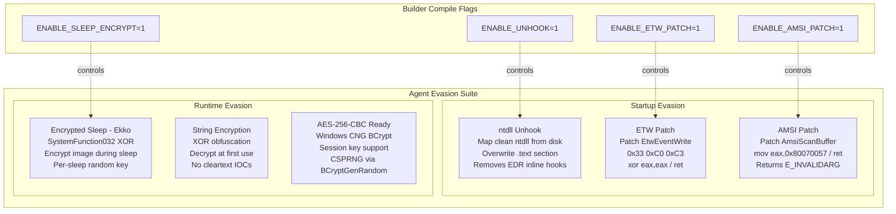

---

## Trust Boundaries

For Microsoft Threat Modeling Tool, define these trust boundaries:

| ID | Boundary Name | Description | Components Inside |
|----|--------------|-------------|-------------------|
| TB1 | C2 Infrastructure | Operator-controlled systems | Team Server, PostgreSQL, Redis, Client |
| TB2 | Team Server Process | Go process boundary | All server-side processes (P1-P8) |
| TB3 | Network Transport | HTTP/HTTPS between server and agent | Agent-to-listener data flows |
| TB4 | Target Network | Compromised host network | Agent process |
| TB5 | Agent Process | Agent memory space | Evasion, BOF loader, command execution |
| TB6 | Database Layer | Data persistence boundary | PostgreSQL, Redis |
| TB7 | Browser/Tauri | Client application boundary | React UI, Zustand stores |

### Trust Boundary Crossings

```mermaid
flowchart TB
    subgraph TB7["TB7: Client Application"]
        CLIENT["Operator Client"]
    end

    subgraph TB1["TB1: C2 Infrastructure"]
        subgraph TB2["TB2: Team Server Process"]
            API["HTTP API"]
            LISTENER["Listener"]
            BUILDER["Builder"]
        end
        subgraph TB6["TB6: Database Layer"]
            PG[("PostgreSQL")]
            RD[("Redis")]
        end
    end

    subgraph TB4["TB4: Target Network"]
        subgraph TB5["TB5: Agent Process"]
            AGENT["Agent"]
        end
    end

    CLIENT -->|"TC1: JWT Auth\nREST over HTTPS"| API
    API -->|"TC2: SSE Events\nover HTTPS"| CLIENT
    AGENT -->|"TC3: HTTP POST\nSysinfo + Results\nSpoofing risk"| LISTENER
    LISTENER -->|"TC4: HTTP Response\nTasks + Agent ID\nTampering risk"| AGENT
    API -->|"TC5: SQL/Redis\nInjection risk"| PG
    API -->|"TC6: Queue ops"| RD

    style TB7 fill:#1a3a5c,stroke:#4a9eff
    style TB1 fill:#1a3a2c,stroke:#4aff9e
    style TB2 fill:#2a4a3c,stroke:#5affae
    style TB6 fill:#3a2a1c,stroke:#ffaa4a
    style TB4 fill:#3a1a1a,stroke:#ff4a4a
    style TB5 fill:#4a2a2a,stroke:#ff6a6a
```

---

## Data Store Inventory

| ID | Name | Technology | Data Stored | Access |
|----|------|-----------|-------------|--------|
| DS1 | PostgreSQL | PostgreSQL 16 | operators, listeners, agents, tasks, task_results, credentials, operations_log | Team Server via pgx pool |
| DS2 | Redis | Redis 7 | Task queues `apex:tasks:{agentID}`, pub/sub channels `apex:results:{agentID}` | Team Server via go-redis |
| DS3 | Agent Source | Filesystem | main.c, evasion.h, bof.h, crypto.h, Makefile | Builder process |
| DS4 | BOF Storage | Filesystem `data/bofs/` | Uploaded .o/.obj COFF object files | Payload Handler |

---

## Process Inventory

| ID | Name | Technology | Input Data | Output Data | Trust Level |
|----|------|-----------|------------|-------------|-------------|
| P1 | HTTP API Router | Go, Chi | REST requests | JSON responses | High |
| P2 | Auth Service | Go, JWT, bcrypt | Credentials | JWT tokens | High |
| P3 | Task Handler | Go | Create task req | Task records | High |
| P4 | Task Queue | Go, Redis | Enqueue/dequeue | Tasks, results | High |
| P5 | Event Hub | Go, SSE | Events | SSE stream | High |
| P6 | HTTP Listener | Go, net/http | Agent POSTs | Task responses | Medium |
| P7 | Agent Manager | Go, pgx | Sysinfo, check-ins | Agent records | High |
| P8 | Payload Builder | Go, exec | Build config | Compiled binary | High |
| P9 | Terminal Page | React, TS | User commands | API calls | Medium |
| P2.1 | Evasion Module | C | Config flags | Patched memory | Low |
| P2.2 | Beacon Loop | C | Server responses | HTTP requests | Low |
| P2.3 | Command Executor | C | Task commands | Command output | Low |
| P2.4 | BOF Loader | C | COFF data | Execution output | Low |

---

## External Entity Inventory

| ID | Name | Description | Trust Level | Interactions |
|----|------|-------------|-------------|--------------|
| EE1 | Operator | Red team operator using Tauri/React client | Trusted | REST API, SSE |
| EE2 | Target Host | Windows machine running C agent | Untrusted | HTTP beacon |
| EE3 | MinGW Compiler | Cross-compiler invoked by builder | Trusted (local) | exec from builder |

---

## Data Flow Inventory

Complete list of data flows for Microsoft Threat Modeling Tool:

| ID | Source | Destination | Protocol | Data | Auth | Encrypted |
|----|--------|-------------|----------|------|------|-----------|
| DF1 | Client | API Router | HTTPS | REST requests + JWT | JWT Bearer | TLS optional |
| DF2 | API Router | Client | HTTPS | JSON responses | Session | TLS optional |
| DF3 | API Router | Client | SSE | Real-time events | JWT query | TLS optional |
| DF4 | Agent | Listener | HTTP/S | Registration sysinfo | None | TLS optional |
| DF5 | Listener | Agent | HTTP/S | Agent ID | None | TLS optional |
| DF6 | Agent | Listener | HTTP/S | Check-in + results | X-Agent-ID | TLS optional |
| DF7 | Listener | Agent | HTTP/S | Task payloads | None | TLS optional |
| DF8 | Task Handler | Redis | TCP | Task JSON RPUSH | None | No |
| DF9 | Listener | Redis | TCP | Dequeue LPOP | None | No |
| DF10 | Redis | Listener | TCP | Task data | None | No |
| DF11 | Listener | Redis | TCP | Result PUBLISH | None | No |
| DF12 | Agent Manager | PostgreSQL | TCP | Agent INSERT/UPDATE | Password | No |
| DF13 | Auth Service | PostgreSQL | TCP | Operator SELECT | Password | No |
| DF14 | Agent Manager | Event Hub | Internal | Agent events | N/A | N/A |
| DF15 | Builder | Source FS | Filesystem | Read source, write binary | OS perms | N/A |
| DF16 | Builder | MinGW | exec | Compile command | N/A | N/A |
| DF17 | Client | Builder | HTTPS | Build config | JWT | TLS optional |
| DF18 | Builder | Client | HTTPS | Binary base64 | JWT | TLS optional |
| DF19 | Client | BOF Store | HTTPS to FS | BOF upload | JWT | TLS optional |
| DF20 | BOF Store | Client | FS to HTTPS | BOF listing | JWT | TLS optional |

---

## STRIDE Threat Mapping

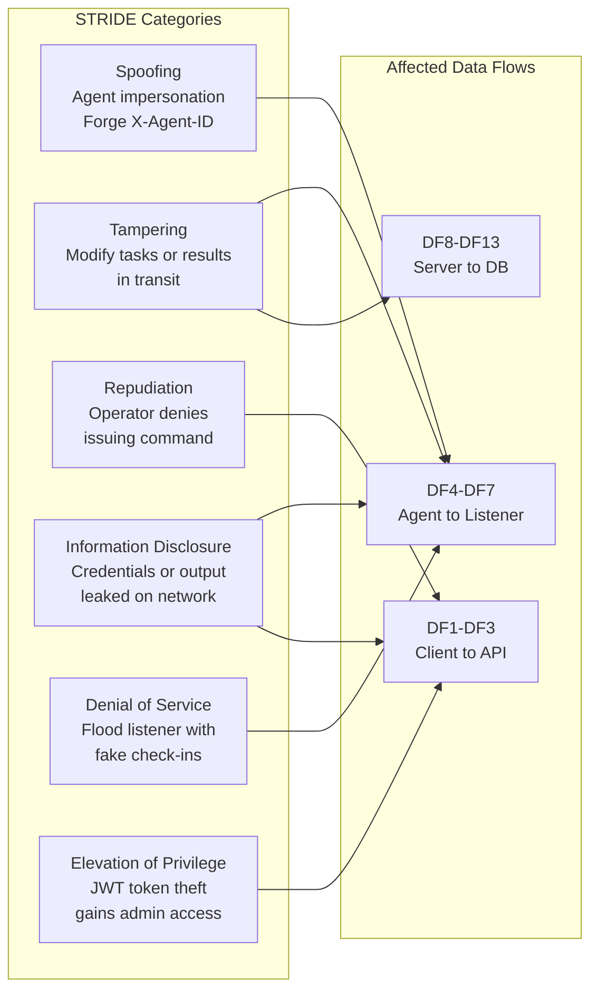

---

## Microsoft Threat Modeling Tool Elements

Summary for recreating in Microsoft TMT:

**External Entities (Interactors):**
- Operator Client - Tauri/React desktop app (trusted)
- Target Host Agent - Windows C implant (untrusted)

**Processes:**
- HTTP API Router, Auth Service, Task Handler, Task Queue, Event Hub, HTTP Listener, Agent Manager, Payload Builder, BOF Loader (inside agent)

**Data Stores:**
- PostgreSQL (relational), Redis (queue + pub/sub), Agent Source (filesystem), BOF Storage (filesystem)

**Trust Boundaries:**
- C2 Infrastructure, Team Server Process, Network Transport, Target Network, Agent Process, Database Layer, Client Application

**Data Flows:**
- 20 flows as documented in the Data Flow Inventory table above
- Each with source, destination, protocol, data content, auth method, encryption status

---

*Generated for Apex C2 Framework v0.1.0. All Mermaid diagrams render natively on GitHub without HTML dependencies.*
