# Apex C2 Framework — Architecture & Data Flow Diagrams

This document provides detailed architecture diagrams and Data Flow Diagrams (DFDs) for the Apex C2 framework. All diagrams use Mermaid syntax compatible with GitHub Markdown rendering. The DFD notation follows Microsoft Threat Modeling Tool conventions with processes, data stores, data flows, external entities, and trust boundaries.

---

## Table of Contents

- [System Context Diagram - DFD Level 0](#system-context-diagram---dfd-level-0)
- [Component Architecture - DFD Level 1](#component-architecture---dfd-level-1)
- [Multi-Platform Agent Architecture](#multi-platform-agent-architecture)
- [Task Execution Sequence](#task-execution-sequence)
- [Agent Communication Sequence](#agent-communication-sequence)
- [Token Manipulation Flow](#token-manipulation-flow)
- [Authentication Flow](#authentication-flow)
- [Payload Generation Flow](#payload-generation-flow)
- [Multi-Platform Build Pipeline](#multi-platform-build-pipeline)
- [Malleable Profile Flow](#malleable-profile-flow)
- [mTLS Communication Flow](#mtls-communication-flow)
- [BOF Execution Flow](#bof-execution-flow)
- [Windows Agent Internal Architecture](#windows-agent-internal-architecture)
- [POSIX Agent Internal Architecture](#posix-agent-internal-architecture)
- [Network Topology](#network-topology)
- [Database Entity Relationship](#database-entity-relationship)
- [SSE Event Flow](#sse-event-flow)
- [Evasion Techniques Diagram](#evasion-techniques-diagram)
- [Trust Boundaries](#trust-boundaries)
- [Data Store Inventory](#data-store-inventory)
- [Process Inventory](#process-inventory)
- [External Entity Inventory](#external-entity-inventory)
- [Data Flow Inventory](#data-flow-inventory)
- [STRIDE Threat Mapping](#stride-threat-mapping)
- [Microsoft Threat Modeling Tool Elements](#microsoft-threat-modeling-tool-elements)

---

## System Context Diagram - DFD Level 0

Highest-level view showing the Apex system and all external entities including multi-platform agents and multiple listener types.

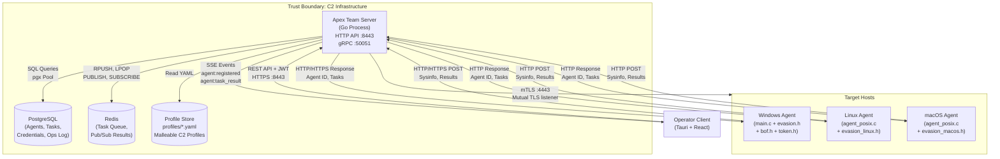
```mermaid
flowchart TB
    subgraph TB1["Trust Boundary: C2 Infrastructure"]
        direction TB
        APEX["Apex Team Server\n(Go Process)\nHTTP API :8443\ngRPC :50051"]
        PG[("PostgreSQL\n(Agents, Tasks,\nCredentials, Ops Log)")]
        RD[("Redis\n(Task Queue,\nPub/Sub Results)")]
        PROFILES[("Profile Store\nprofiles/*.yaml\nMalleable C2 Profiles")]
    end

    OP["Operator Client\n(Tauri + React)"]

    subgraph TARGETS["Target Hosts"]
        TGT_WIN["Windows Agent\n(main.c + evasion.h\n+ bof.h + token.h)"]
        TGT_LIN["Linux Agent\n(agent_posix.c\n+ evasion_linux.h)"]
        TGT_MAC["macOS Agent\n(agent_posix.c\n+ evasion_macos.h)"]
    end

    OP -->|"REST API + JWT\nHTTPS :8443"| APEX
    APEX -->|"SSE Events\nagent:registered\nagent:task_result"| OP
    TGT_WIN -->|"HTTP/HTTPS POST\nSysinfo, Results"| APEX
    APEX -->|"HTTP/HTTPS Response\nAgent ID, Tasks"| TGT_WIN
    TGT_LIN -->|"HTTP POST\nSysinfo, Results"| APEX
    APEX -->|"HTTP Response\nAgent ID, Tasks"| TGT_LIN
    TGT_MAC -->|"HTTP POST\nSysinfo, Results"| APEX
    APEX -->|"HTTP Response\nAgent ID, Tasks"| TGT_MAC
    APEX -->|"mTLS :4443\nMutual TLS listener"| TARGETS
    APEX -->|"SQL Queries\npgx Pool"| PG
    APEX -->|"RPUSH, LPOP\nPUBLISH, SUBSCRIBE"| RD
    APEX -->|"Read YAML"| PROFILES
```

---

## Component Architecture - DFD Level 1

Internal decomposition of the Apex Team Server into processes and data stores, including the profile handler, mTLS listener, and multi-platform builder.

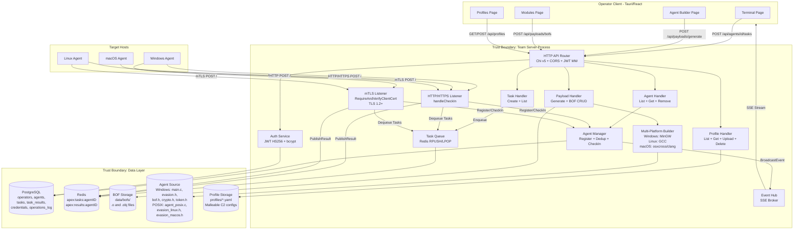
```mermaid
flowchart TB
    subgraph CLIENT["Operator Client - Tauri/React"]
        TERM["Terminal Page"]
        BUILDER_UI["Agent Builder Page"]
        MODULES_UI["Modules Page"]
        PROFILES_UI["Profiles Page"]
    end

    subgraph SERVER["Trust Boundary: Team Server Process"]
        direction TB
        ROUTER["HTTP API Router\nChi v5 + CORS + JWT MW"]
        AUTH["Auth Service\nJWT HS256 + bcrypt"]
        TASK_H["Task Handler\nCreate + List"]
        AGENT_H["Agent Handler\nList + Get + Remove"]
        PAYLOAD_H["Payload Handler\nGenerate + BOF CRUD"]
        PROFILE_H["Profile Handler\nList + Get + Upload + Delete"]
        EVT["Event Hub\nSSE Broker"]
        HTTP_LIS["HTTP/HTTPS Listener\nhandleCheckIn"]
        MTLS_LIS["mTLS Listener\nRequireAndVerifyClientCert\nTLS 1.2+"]
        AGENT_MGR["Agent Manager\nRegister + Dedup + CheckIn"]
        TASK_Q["Task Queue\nRedis RPUSH/LPOP"]
        BLDR["Multi-Platform Builder\nWindows: MinGW\nLinux: GCC\nmacOS: osxcross/clang"]
    end

    subgraph STORAGE["Trust Boundary: Data Layer"]
        PG[("PostgreSQL\noperators, agents,\ntasks, task_results,\ncredentials, operations_log")]
        RD[("Redis\napex:tasks:agentID\napex:results:agentID")]
        BOF_FS[("BOF Storage\ndata/bofs/\n.o and .obj files")]
        SRC_FS[("Agent Source\nWindows: main.c, evasion.h,\nbof.h, crypto.h, token.h\nPOSIX: agent_posix.c,\nevasion_linux.h, evasion_macos.h")]
        PROF_FS[("Profile Storage\nprofiles/*.yaml\nMalleable C2 configs")]
    end

    subgraph AGENTS["Target Hosts"]
        WIN_AGENT["Windows Agent"]
        LIN_AGENT["Linux Agent"]
        MAC_AGENT["macOS Agent"]
    end

    TERM -->|"POST /api/agents/id/tasks"| ROUTER
    BUILDER_UI -->|"POST /api/payloads/generate"| ROUTER
    MODULES_UI -->|"POST /api/payloads/bofs"| ROUTER
    PROFILES_UI -->|"GET/POST /api/profiles"| ROUTER
    ROUTER --> AUTH
    ROUTER --> TASK_H
    ROUTER --> AGENT_H
    ROUTER --> PAYLOAD_H
    ROUTER --> PROFILE_H
    EVT -->|"SSE Stream"| CLIENT
    TASK_H -->|"Enqueue"| TASK_Q
    TASK_Q --> RD
    AGENT_H --> AGENT_MGR
    AGENT_MGR --> PG
    PAYLOAD_H --> BLDR
    PAYLOAD_H --> BOF_FS
    PROFILE_H --> PROF_FS
    BLDR --> SRC_FS
    AUTH --> PG

    WIN_AGENT -->|"HTTP/HTTPS POST /"| HTTP_LIS
    LIN_AGENT -->|"HTTP POST /"| HTTP_LIS
    MAC_AGENT -->|"HTTP POST /"| HTTP_LIS
    WIN_AGENT -->|"mTLS POST /"| MTLS_LIS
    LIN_AGENT -->|"mTLS POST /"| MTLS_LIS

    HTTP_LIS -->|"Dequeue Tasks"| TASK_Q
    HTTP_LIS -->|"Register/CheckIn"| AGENT_MGR
    HTTP_LIS -->|"PublishResult"| RD
    MTLS_LIS -->|"Dequeue Tasks"| TASK_Q
    MTLS_LIS -->|"Register/CheckIn"| AGENT_MGR
    MTLS_LIS -->|"PublishResult"| RD
    AGENT_MGR -->|"BroadcastEvent"| EVT
```

---

## Multi-Platform Agent Architecture

The agent codebase is split by platform. Windows uses `main.c` with Windows-specific headers. Linux and macOS share `agent_posix.c` and select platform-specific evasion headers at compile time via `#ifdef __APPLE__`.

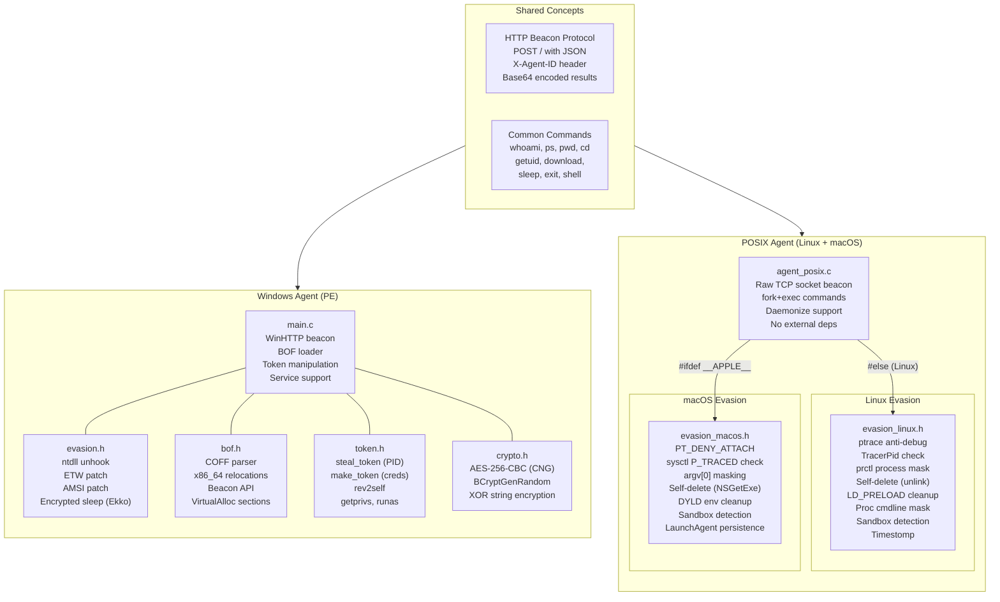
```mermaid
flowchart TB
    subgraph SHARED["Shared Concepts"]
        BEACON_PROTO["HTTP Beacon Protocol\nPOST / with JSON\nX-Agent-ID header\nBase64 encoded results"]
        CMD_SET["Common Commands\nwhoami, ps, pwd, cd\ngetuid, download,\nsleep, exit, shell"]
    end

    subgraph WIN_AGENT["Windows Agent (PE)"]
        direction TB
        WIN_MAIN["main.c\nWinHTTP beacon\nBOF loader\nToken manipulation\nService support"]
        WIN_EVASION["evasion.h\nntdll unhook\nETW patch\nAMSI patch\nEncrypted sleep (Ekko)"]
        WIN_BOF["bof.h\nCOFF parser\nx86_64 relocations\nBeacon API\nVirtualAlloc sections"]
        WIN_TOKEN["token.h\nsteal_token (PID)\nmake_token (creds)\nrev2self\ngetprivs, runas"]
        WIN_CRYPTO["crypto.h\nAES-256-CBC (CNG)\nBCryptGenRandom\nXOR string encryption"]
        WIN_MAIN --- WIN_EVASION
        WIN_MAIN --- WIN_BOF
        WIN_MAIN --- WIN_TOKEN
        WIN_MAIN --- WIN_CRYPTO
    end

    subgraph POSIX_AGENT["POSIX Agent (Linux + macOS)"]
        direction TB
        POSIX_MAIN["agent_posix.c\nRaw TCP socket beacon\nfork+exec commands\nDaemonize support\nNo external deps"]

        subgraph LINUX_EV["Linux Evasion"]
            LINUX_HDR["evasion_linux.h\nptrace anti-debug\nTracerPid check\nprctl process mask\nSelf-delete (unlink)\nLD_PRELOAD cleanup\nProc cmdline mask\nSandbox detection\nTimestomp"]
        end

        subgraph MACOS_EV["macOS Evasion"]
            MACOS_HDR["evasion_macos.h\nPT_DENY_ATTACH\nsysctl P_TRACED check\nargv[0] masking\nSelf-delete (NSGetExe)\nDYLD env cleanup\nSandbox detection\nLaunchAgent persistence"]
        end

        POSIX_MAIN -->|"#ifdef __APPLE__"| MACOS_HDR
        POSIX_MAIN -->|"#else (Linux)"| LINUX_HDR
    end

    SHARED --> WIN_AGENT
    SHARED --> POSIX_AGENT
```

---

## Task Execution Sequence

End-to-end flow from operator command to result display, supporting all agent platforms.

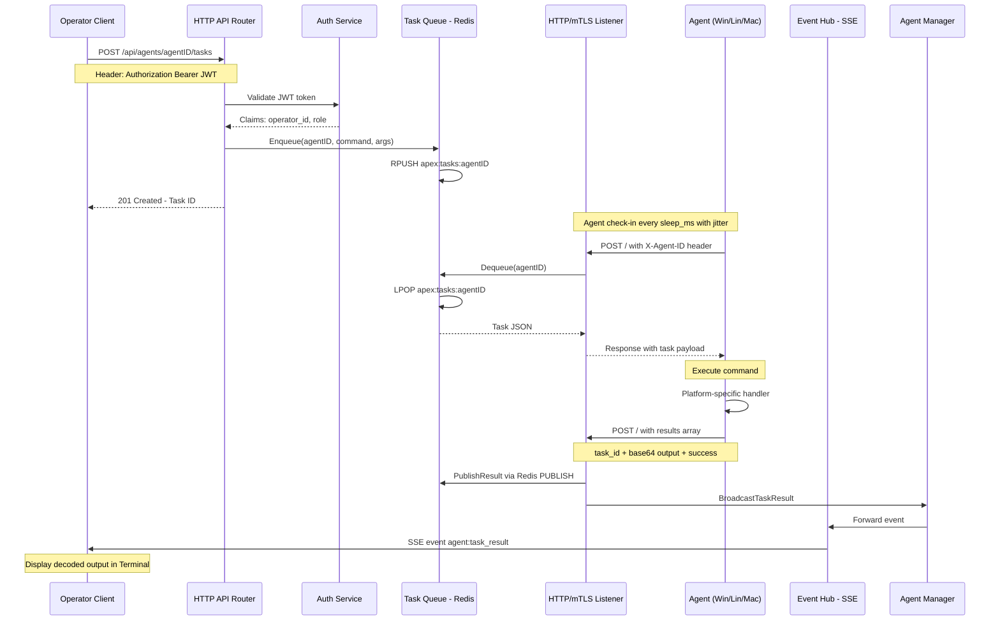
```mermaid
sequenceDiagram
    participant OP as Operator Client
    participant API as HTTP API Router
    participant AUTH as Auth Service
    participant TQ as Task Queue - Redis
    participant LIS as HTTP/mTLS Listener
    participant AGT as Agent (Win/Lin/Mac)
    participant EVT as Event Hub - SSE
    participant MGR as Agent Manager

    OP->>API: POST /api/agents/agentID/tasks
    Note over OP,API: Header: Authorization Bearer JWT
    API->>AUTH: Validate JWT token
    AUTH-->>API: Claims: operator_id, role
    API->>TQ: Enqueue(agentID, command, args)
    TQ->>TQ: RPUSH apex:tasks:agentID
    API-->>OP: 201 Created - Task ID

    Note over AGT,LIS: Agent check-in every sleep_ms with jitter
    AGT->>LIS: POST / with X-Agent-ID header
    LIS->>TQ: Dequeue(agentID)
    TQ->>TQ: LPOP apex:tasks:agentID
    TQ-->>LIS: Task JSON
    LIS-->>AGT: Response with task payload

    Note over AGT: Execute command
    AGT->>AGT: Platform-specific handler
    AGT->>LIS: POST / with results array
    Note over AGT,LIS: task_id + base64 output + success

    LIS->>TQ: PublishResult via Redis PUBLISH
    LIS->>MGR: BroadcastTaskResult
    MGR->>EVT: Forward event
    EVT->>OP: SSE event agent:task_result
    Note over OP: Display decoded output in Terminal
```

---

## Agent Communication Sequence

Registration and beacon lifecycle showing platform-specific evasion at startup.

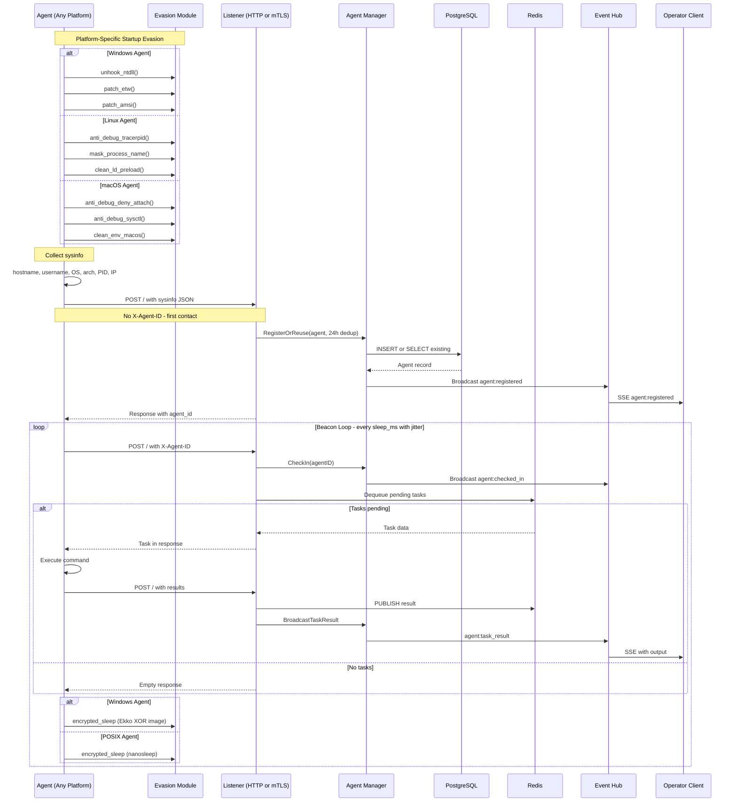
```mermaid
sequenceDiagram
    participant AGT as Agent (Any Platform)
    participant EVA as Evasion Module
    participant LIS as Listener (HTTP or mTLS)
    participant MGR as Agent Manager
    participant PG as PostgreSQL
    participant RD as Redis
    participant EVT as Event Hub
    participant OP as Operator Client

    Note over AGT,EVA: Platform-Specific Startup Evasion
    alt Windows Agent
        AGT->>EVA: unhook_ntdll()
        AGT->>EVA: patch_etw()
        AGT->>EVA: patch_amsi()
    else Linux Agent
        AGT->>EVA: anti_debug_tracerpid()
        AGT->>EVA: mask_process_name()
        AGT->>EVA: clean_ld_preload()
    else macOS Agent
        AGT->>EVA: anti_debug_deny_attach()
        AGT->>EVA: anti_debug_sysctl()
        AGT->>EVA: clean_env_macos()
    end

    Note over AGT: Collect sysinfo
    AGT->>AGT: hostname, username, OS, arch, PID, IP

    AGT->>LIS: POST / with sysinfo JSON
    Note over AGT,LIS: No X-Agent-ID - first contact
    LIS->>MGR: RegisterOrReuse(agent, 24h dedup)
    MGR->>PG: INSERT or SELECT existing
    PG-->>MGR: Agent record
    MGR->>EVT: Broadcast agent:registered
    EVT->>OP: SSE agent:registered
    LIS-->>AGT: Response with agent_id

    loop Beacon Loop - every sleep_ms with jitter
        AGT->>LIS: POST / with X-Agent-ID
        LIS->>MGR: CheckIn(agentID)
        MGR->>EVT: Broadcast agent:checked_in
        LIS->>RD: Dequeue pending tasks
        alt Tasks pending
            RD-->>LIS: Task data
            LIS-->>AGT: Task in response
            AGT->>AGT: Execute command
            AGT->>LIS: POST / with results
            LIS->>RD: PUBLISH result
            LIS->>MGR: BroadcastTaskResult
            MGR->>EVT: agent:task_result
            EVT->>OP: SSE with output
        else No tasks
            LIS-->>AGT: Empty response
        end
        alt Windows Agent
            AGT->>EVA: encrypted_sleep (Ekko XOR image)
        else POSIX Agent
            AGT->>EVA: encrypted_sleep (nanosleep)
        end
    end
```

---

## Token Manipulation Flow

Windows-only token stealing, creation, and reversion sequence between operator, team server, and Windows agent.

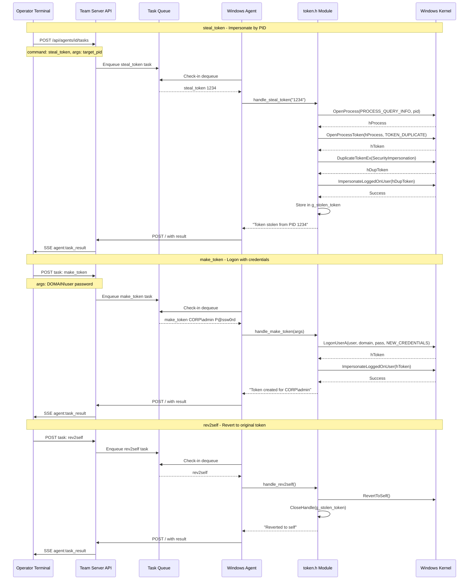
```mermaid
sequenceDiagram
    participant OP as Operator Terminal
    participant API as Team Server API
    participant TQ as Task Queue
    participant AGT as Windows Agent
    participant TOK as token.h Module
    participant WIN as Windows Kernel

    Note over OP,WIN: steal_token - Impersonate by PID
    OP->>API: POST /api/agents/id/tasks
    Note over OP,API: command: steal_token, args: target_pid
    API->>TQ: Enqueue steal_token task
    AGT->>TQ: Check-in dequeue
    TQ-->>AGT: steal_token 1234
    AGT->>TOK: handle_steal_token("1234")
    TOK->>WIN: OpenProcess(PROCESS_QUERY_INFO, pid)
    WIN-->>TOK: hProcess
    TOK->>WIN: OpenProcessToken(hProcess, TOKEN_DUPLICATE)
    WIN-->>TOK: hToken
    TOK->>WIN: DuplicateTokenEx(SecurityImpersonation)
    WIN-->>TOK: hDupToken
    TOK->>WIN: ImpersonateLoggedOnUser(hDupToken)
    WIN-->>TOK: Success
    TOK->>TOK: Store in g_stolen_token
    TOK-->>AGT: "Token stolen from PID 1234"
    AGT->>API: POST / with result
    API->>OP: SSE agent:task_result

    Note over OP,WIN: make_token - Logon with credentials
    OP->>API: POST task: make_token
    Note over OP,API: args: DOMAIN\user password
    API->>TQ: Enqueue make_token task
    AGT->>TQ: Check-in dequeue
    TQ-->>AGT: make_token CORP\admin P@ssw0rd
    AGT->>TOK: handle_make_token(args)
    TOK->>WIN: LogonUserA(user, domain, pass, NEW_CREDENTIALS)
    WIN-->>TOK: hToken
    TOK->>WIN: ImpersonateLoggedOnUser(hToken)
    WIN-->>TOK: Success
    TOK-->>AGT: "Token created for CORP\admin"
    AGT->>API: POST / with result
    API->>OP: SSE agent:task_result

    Note over OP,WIN: rev2self - Revert to original token
    OP->>API: POST task: rev2self
    API->>TQ: Enqueue rev2self task
    AGT->>TQ: Check-in dequeue
    TQ-->>AGT: rev2self
    AGT->>TOK: handle_rev2self()
    TOK->>WIN: RevertToSelf()
    TOK->>TOK: CloseHandle(g_stolen_token)
    TOK-->>AGT: "Reverted to self"
    AGT->>API: POST / with result
    API->>OP: SSE agent:task_result
```

---

## Authentication Flow

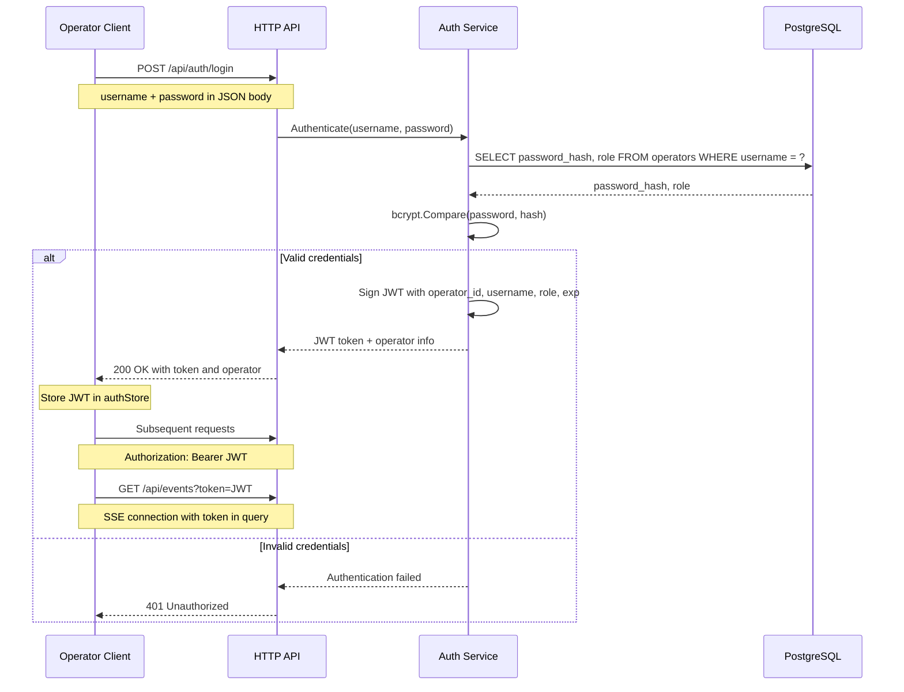
```mermaid
sequenceDiagram
    participant OP as Operator Client
    participant API as HTTP API
    participant AUTH as Auth Service
    participant PG as PostgreSQL

    OP->>API: POST /api/auth/login
    Note over OP,API: username + password in JSON body

    API->>AUTH: Authenticate(username, password)
    AUTH->>PG: SELECT password_hash, role FROM operators WHERE username = ?
    PG-->>AUTH: password_hash, role

    AUTH->>AUTH: bcrypt.Compare(password, hash)

    alt Valid credentials
        AUTH->>AUTH: Sign JWT with operator_id, username, role, exp
        AUTH-->>API: JWT token + operator info
        API-->>OP: 200 OK with token and operator
        Note over OP: Store JWT in authStore

        OP->>API: Subsequent requests
        Note over OP,API: Authorization: Bearer JWT

        OP->>API: GET /api/events?token=JWT
        Note over OP,API: SSE connection with token in query
    else Invalid credentials
        AUTH-->>API: Authentication failed
        API-->>OP: 401 Unauthorized
    end
```

---

## Payload Generation Flow

Shows platform selection, profile application, and platform-specific compilation.

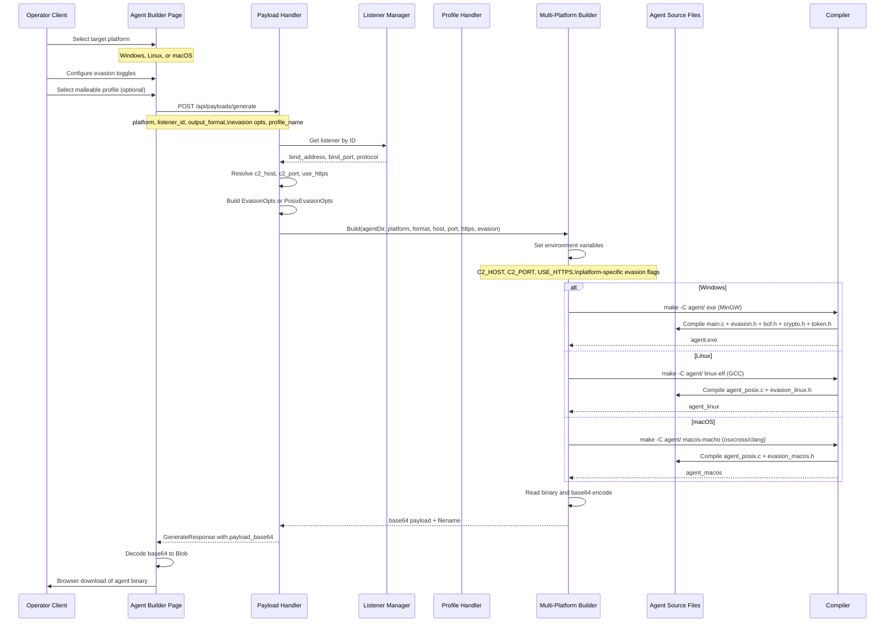
```mermaid
sequenceDiagram
    participant OP as Operator Client
    participant UI as Agent Builder Page
    participant API as Payload Handler
    participant LMGR as Listener Manager
    participant PROF as Profile Handler
    participant BLDR as Multi-Platform Builder
    participant FS as Agent Source Files
    participant CC as Compiler

    OP->>UI: Select target platform
    Note over UI: Windows, Linux, or macOS
    OP->>UI: Configure evasion toggles
    OP->>UI: Select malleable profile (optional)

    UI->>API: POST /api/payloads/generate
    Note over UI,API: platform, listener_id, output_format,\nevasion opts, profile_name

    API->>LMGR: Get listener by ID
    LMGR-->>API: bind_address, bind_port, protocol

    API->>API: Resolve c2_host, c2_port, use_https
    API->>API: Build EvasionOpts or PosixEvasionOpts

    API->>BLDR: Build(agentDir, platform, format, host, port, https, evasion)

    BLDR->>BLDR: Set environment variables
    Note over BLDR: C2_HOST, C2_PORT, USE_HTTPS,\nplatform-specific evasion flags

    alt Windows
        BLDR->>CC: make -C agent/ exe (MinGW)
        CC->>FS: Compile main.c + evasion.h + bof.h + crypto.h + token.h
        CC-->>BLDR: agent.exe
    else Linux
        BLDR->>CC: make -C agent/ linux-elf (GCC)
        CC->>FS: Compile agent_posix.c + evasion_linux.h
        CC-->>BLDR: agent_linux
    else macOS
        BLDR->>CC: make -C agent/ macos-macho (osxcross/clang)
        CC->>FS: Compile agent_posix.c + evasion_macos.h
        CC-->>BLDR: agent_macos
    end

    BLDR->>BLDR: Read binary and base64 encode
    BLDR-->>API: base64 payload + filename

    API-->>UI: GenerateResponse with payload_base64
    UI->>UI: Decode base64 to Blob
    UI->>OP: Browser download of agent binary
```

---

## Multi-Platform Build Pipeline

Detailed flowchart of how the builder selects the compiler, flags, and make target based on the requested platform.

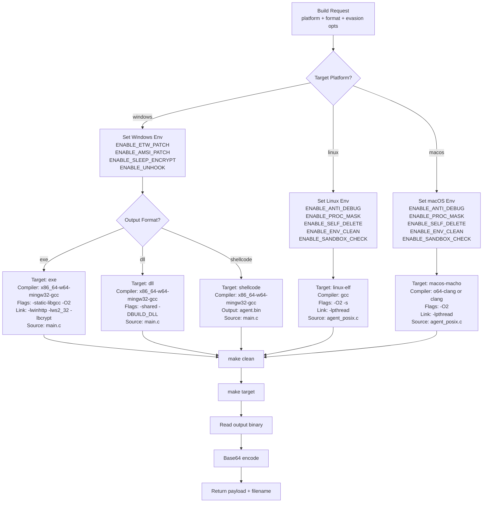
```mermaid
flowchart TB
    START["Build Request\nplatform + format + evasion opts"]

    START --> PLATFORM{"Target Platform?"}

    PLATFORM -->|"windows"| WIN_ENV["Set Windows Env\nENABLE_ETW_PATCH\nENABLE_AMSI_PATCH\nENABLE_SLEEP_ENCRYPT\nENABLE_UNHOOK"]
    PLATFORM -->|"linux"| LIN_ENV["Set Linux Env\nENABLE_ANTI_DEBUG\nENABLE_PROC_MASK\nENABLE_SELF_DELETE\nENABLE_ENV_CLEAN\nENABLE_SANDBOX_CHECK"]
    PLATFORM -->|"macos"| MAC_ENV["Set macOS Env\nENABLE_ANTI_DEBUG\nENABLE_PROC_MASK\nENABLE_SELF_DELETE\nENABLE_ENV_CLEAN\nENABLE_SANDBOX_CHECK"]

    WIN_ENV --> WIN_FMT{"Output Format?"}
    WIN_FMT -->|"exe"| WIN_EXE["Target: exe\nCompiler: x86_64-w64-mingw32-gcc\nFlags: -static-libgcc -O2\nLink: -lwinhttp -lws2_32 -lbcrypt\nSource: main.c"]
    WIN_FMT -->|"dll"| WIN_DLL["Target: dll\nCompiler: x86_64-w64-mingw32-gcc\nFlags: -shared -DBUILD_DLL\nSource: main.c"]
    WIN_FMT -->|"shellcode"| WIN_SC["Target: shellcode\nCompiler: x86_64-w64-mingw32-gcc\nOutput: agent.bin\nSource: main.c"]

    LIN_ENV --> LIN_BUILD["Target: linux-elf\nCompiler: gcc\nFlags: -O2 -s\nLink: -lpthread\nSource: agent_posix.c"]

    MAC_ENV --> MAC_BUILD["Target: macos-macho\nCompiler: o64-clang or clang\nFlags: -O2\nLink: -lpthread\nSource: agent_posix.c"]

    WIN_EXE --> CLEAN["make clean"]
    WIN_DLL --> CLEAN
    WIN_SC --> CLEAN
    LIN_BUILD --> CLEAN
    MAC_BUILD --> CLEAN

    CLEAN --> COMPILE["make target"]
    COMPILE --> READ["Read output binary"]
    READ --> B64["Base64 encode"]
    B64 --> RESPOND["Return payload + filename"]
```

---

## Malleable Profile Flow

Shows how malleable C2 profiles are uploaded, stored, and applied to shape agent traffic patterns.

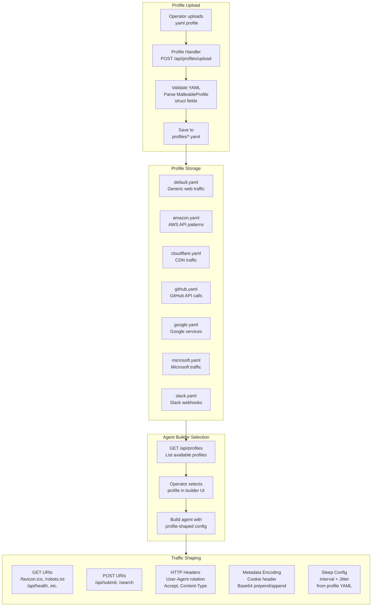
```mermaid
flowchart TB
    subgraph UPLOAD["Profile Upload"]
        direction TB
        OP_UP["Operator uploads\n.yaml profile"]
        API_UP["Profile Handler\nPOST /api/profiles/upload"]
        VALIDATE["Validate YAML\nParse MalleableProfile\nstruct fields"]
        SAVE["Save to\nprofiles/*.yaml"]
        OP_UP --> API_UP --> VALIDATE --> SAVE
    end

    subgraph STORAGE["Profile Storage"]
        direction LR
        P_DEFAULT["default.yaml\nGeneric web traffic"]
        P_AMAZON["amazon.yaml\nAWS API patterns"]
        P_CLOUD["cloudflare.yaml\nCDN traffic"]
        P_GITHUB["github.yaml\nGitHub API calls"]
        P_GOOGLE["google.yaml\nGoogle services"]
        P_MSFT["microsoft.yaml\nMicrosoft traffic"]
        P_SLACK["slack.yaml\nSlack webhooks"]
    end

    subgraph SELECTION["Agent Builder Selection"]
        direction TB
        LIST["GET /api/profiles\nList available profiles"]
        SELECT["Operator selects\nprofile in builder UI"]
        BUILDER["Build agent with\nprofile-shaped config"]
    end

    subgraph SHAPING["Traffic Shaping"]
        direction TB
        GET_URI["GET URIs\n/favicon.ico, /robots.txt\n/api/health, etc."]
        POST_URI["POST URIs\n/api/submit, /search"]
        HEADERS["HTTP Headers\nUser-Agent rotation\nAccept, Content-Type"]
        METADATA["Metadata Encoding\nCookie header\nBase64 prepend/append"]
        SLEEP_CFG["Sleep Config\nInterval + Jitter\nfrom profile YAML"]
    end

    SAVE --> STORAGE
    STORAGE --> LIST --> SELECT --> BUILDER
    BUILDER --> SHAPING
```

---

## mTLS Communication Flow

Sequence diagram showing the mutual TLS handshake between agent and mTLS listener, where both sides present and verify certificates.

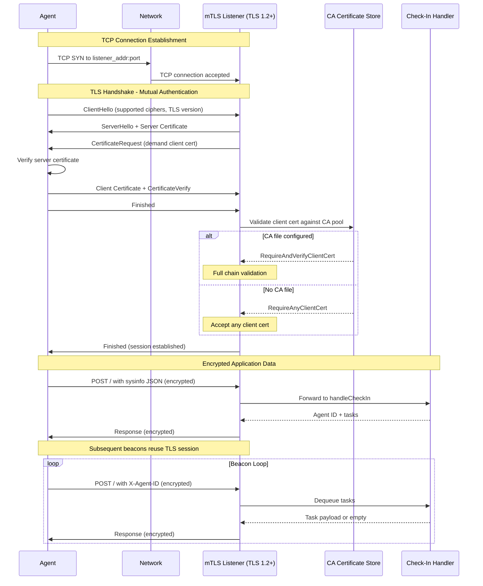
```mermaid
sequenceDiagram
    participant AGT as Agent
    participant NET as Network
    participant MTLS as mTLS Listener (TLS 1.2+)
    participant CA as CA Certificate Store
    participant HANDLER as Check-In Handler

    Note over AGT,MTLS: TCP Connection Establishment
    AGT->>NET: TCP SYN to listener_addr:port
    NET->>MTLS: TCP connection accepted

    Note over AGT,MTLS: TLS Handshake - Mutual Authentication
    AGT->>MTLS: ClientHello (supported ciphers, TLS version)
    MTLS->>AGT: ServerHello + Server Certificate
    MTLS->>AGT: CertificateRequest (demand client cert)

    AGT->>AGT: Verify server certificate
    AGT->>MTLS: Client Certificate + CertificateVerify
    AGT->>MTLS: Finished

    MTLS->>CA: Validate client cert against CA pool
    alt CA file configured
        CA-->>MTLS: RequireAndVerifyClientCert
        Note over MTLS: Full chain validation
    else No CA file
        CA-->>MTLS: RequireAnyClientCert
        Note over MTLS: Accept any client cert
    end

    MTLS->>AGT: Finished (session established)

    Note over AGT,HANDLER: Encrypted Application Data
    AGT->>MTLS: POST / with sysinfo JSON (encrypted)
    MTLS->>HANDLER: Forward to handleCheckIn
    HANDLER-->>MTLS: Agent ID + tasks
    MTLS->>AGT: Response (encrypted)

    Note over AGT,MTLS: Subsequent beacons reuse TLS session
    loop Beacon Loop
        AGT->>MTLS: POST / with X-Agent-ID (encrypted)
        MTLS->>HANDLER: Dequeue tasks
        HANDLER-->>MTLS: Task payload or empty
        MTLS->>AGT: Response (encrypted)
    end
```

---

## BOF Execution Flow

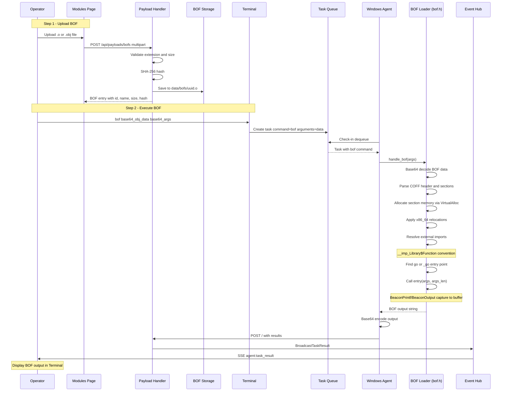
```mermaid
sequenceDiagram
    participant OP as Operator
    participant MOD as Modules Page
    participant API as Payload Handler
    participant FS as BOF Storage
    participant TERM as Terminal
    participant TQ as Task Queue
    participant AGT as Windows Agent
    participant BOF as BOF Loader (bof.h)
    participant EVT as Event Hub

    Note over OP,MOD: Step 1 - Upload BOF
    OP->>MOD: Upload .o or .obj file
    MOD->>API: POST /api/payloads/bofs multipart
    API->>API: Validate extension and size
    API->>API: SHA-256 hash
    API->>FS: Save to data/bofs/uuid.o
    API-->>MOD: BOF entry with id, name, size, hash

    Note over OP,TERM: Step 2 - Execute BOF
    OP->>TERM: bof base64_obj_data base64_args
    TERM->>TQ: Create task command=bof arguments=data

    AGT->>TQ: Check-in dequeue
    TQ-->>AGT: Task with bof command

    AGT->>BOF: handle_bof(args)
    BOF->>BOF: Base64 decode BOF data
    BOF->>BOF: Parse COFF header and sections
    BOF->>BOF: Allocate section memory via VirtualAlloc
    BOF->>BOF: Apply x86_64 relocations
    BOF->>BOF: Resolve external imports
    Note over BOF: __imp_Library$Function convention
    BOF->>BOF: Find go or _go entry point
    BOF->>BOF: Call entry(args, args_len)
    Note over BOF: BeaconPrintf/BeaconOutput capture to buffer

    BOF-->>AGT: BOF output string

    AGT->>AGT: Base64 encode output
    AGT->>API: POST / with results
    API->>EVT: BroadcastTaskResult
    EVT->>OP: SSE agent:task_result
    Note over OP: Display BOF output in Terminal
```

---

## Windows Agent Internal Architecture

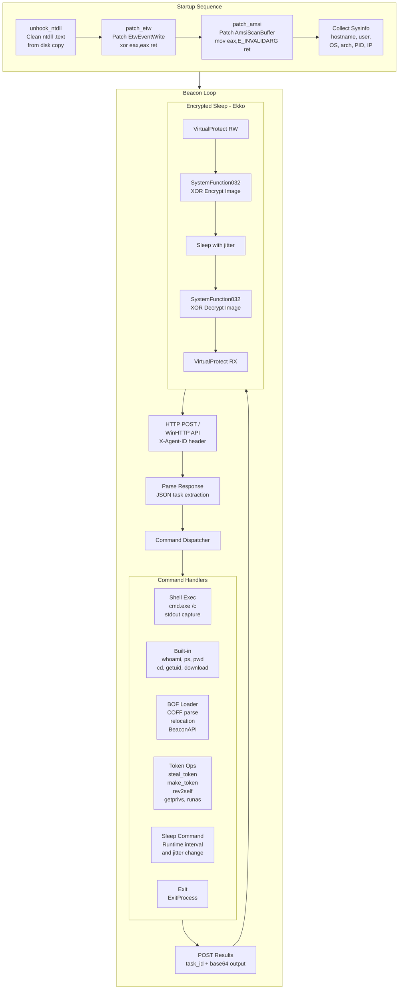
```mermaid
flowchart TB
    subgraph STARTUP["Startup Sequence"]
        direction LR
        S1["unhook_ntdll\nClean ntdll .text\nfrom disk copy"]
        S2["patch_etw\nPatch EtwEventWrite\nxor eax,eax ret"]
        S3["patch_amsi\nPatch AmsiScanBuffer\nmov eax,E_INVALIDARG ret"]
        S4["Collect Sysinfo\nhostname, user,\nOS, arch, PID, IP"]
        S1 --> S2 --> S3 --> S4
    end

    subgraph BEACON["Beacon Loop"]
        direction TB
        POST["HTTP POST /\nWinHTTP API\nX-Agent-ID header"]
        PARSE["Parse Response\nJSON task extraction"]
        DISPATCH["Command Dispatcher"]

        POST --> PARSE --> DISPATCH

        subgraph COMMANDS["Command Handlers"]
            direction LR
            CMD_SHELL["Shell Exec\ncmd.exe /c\nstdout capture"]
            CMD_BUILTIN["Built-in\nwhoami, ps, pwd\ncd, getuid, download"]
            CMD_BOF["BOF Loader\nCOFF parse\nrelocation\nBeaconAPI"]
            CMD_TOKEN["Token Ops\nsteal_token\nmake_token\nrev2self\ngetprivs, runas"]
            CMD_SLEEP["Sleep Command\nRuntime interval\nand jitter change"]
            CMD_EXIT["Exit\nExitProcess"]
        end

        DISPATCH --> COMMANDS

        RESULT["POST Results\ntask_id + base64 output"]
        COMMANDS --> RESULT

        subgraph SLEEP["Encrypted Sleep - Ekko"]
            direction TB
            SL1["VirtualProtect RW"]
            SL2["SystemFunction032\nXOR Encrypt Image"]
            SL3["Sleep with jitter"]
            SL4["SystemFunction032\nXOR Decrypt Image"]
            SL5["VirtualProtect RX"]
            SL1 --> SL2 --> SL3 --> SL4 --> SL5
        end

        RESULT --> SLEEP
        SLEEP --> POST
    end

    STARTUP --> BEACON
```

---

## POSIX Agent Internal Architecture

Internal architecture for the shared Linux/macOS agent (`agent_posix.c`).

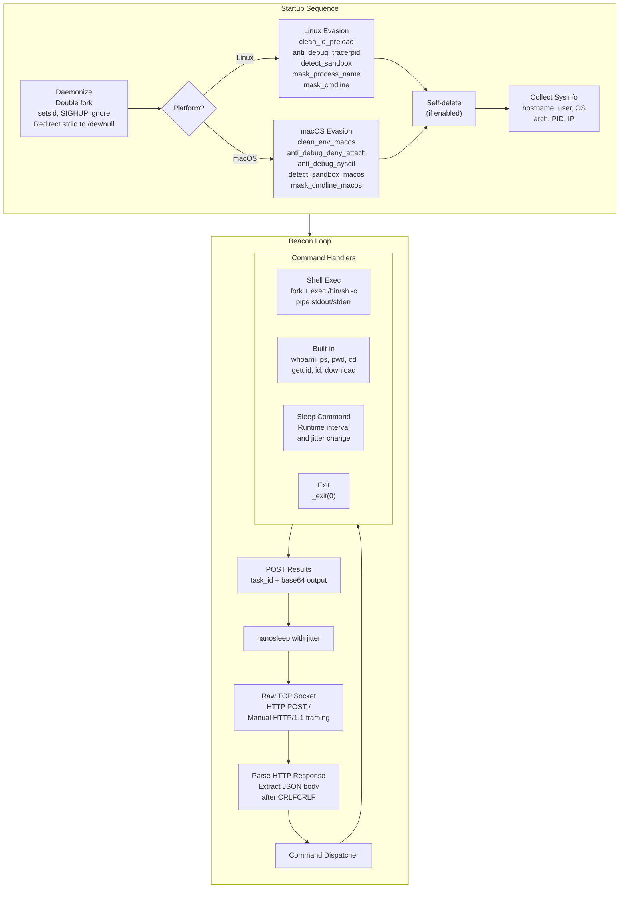
```mermaid
flowchart TB
    subgraph STARTUP["Startup Sequence"]
        direction LR
        D1["Daemonize\nDouble fork\nsetsid, SIGHUP ignore\nRedirect stdio to /dev/null"]
        D2{"Platform?"}
        D3_LIN["Linux Evasion\nclean_ld_preload\nanti_debug_tracerpid\ndetect_sandbox\nmask_process_name\nmask_cmdline"]
        D3_MAC["macOS Evasion\nclean_env_macos\nanti_debug_deny_attach\nanti_debug_sysctl\ndetect_sandbox_macos\nmask_cmdline_macos"]
        D4["Self-delete\n(if enabled)"]
        D5["Collect Sysinfo\nhostname, user, OS\narch, PID, IP"]
        D1 --> D2
        D2 -->|"Linux"| D3_LIN --> D4
        D2 -->|"macOS"| D3_MAC --> D4
        D4 --> D5
    end

    subgraph BEACON["Beacon Loop"]
        direction TB
        CONN["Raw TCP Socket\nHTTP POST /\nManual HTTP/1.1 framing"]
        PARSE["Parse HTTP Response\nExtract JSON body\nafter CRLFCRLF"]
        DISPATCH["Command Dispatcher"]

        CONN --> PARSE --> DISPATCH

        subgraph COMMANDS["Command Handlers"]
            direction LR
            CMD_SHELL["Shell Exec\nfork + exec /bin/sh -c\npipe stdout/stderr"]
            CMD_BUILTIN["Built-in\nwhoami, ps, pwd, cd\ngetuid, id, download"]
            CMD_SLEEP["Sleep Command\nRuntime interval\nand jitter change"]
            CMD_EXIT["Exit\n_exit(0)"]
        end

        DISPATCH --> COMMANDS

        RESULT["POST Results\ntask_id + base64 output"]
        COMMANDS --> RESULT

        SLEEP_BLK["nanosleep with jitter"]
        RESULT --> SLEEP_BLK
        SLEEP_BLK --> CONN
    end

    STARTUP --> BEACON
```

---

## Network Topology

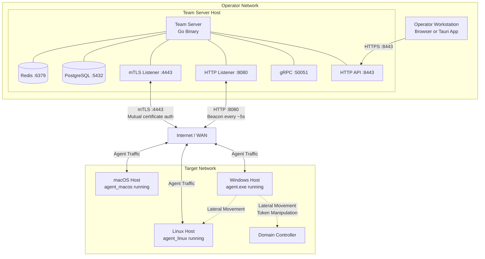
```mermaid
flowchart TB
    subgraph OPNET["Operator Network"]
        direction TB
        WORKSTATION["Operator Workstation\nBrowser or Tauri App"]
        subgraph SRVHOST["Team Server Host"]
            direction LR
            SRV["Team Server\nGo Binary"]
            HTTPAPI["HTTP API :8443"]
            GRPC["gRPC :50051"]
            HTTP_LIS["HTTP Listener :8080"]
            MTLS_LIS["mTLS Listener :4443"]
            PGDB[("PostgreSQL :5432")]
            RDDB[("Redis :6379")]
            SRV --- HTTPAPI
            SRV --- GRPC
            SRV --- HTTP_LIS
            SRV --- MTLS_LIS
            SRV --- PGDB
            SRV --- RDDB
        end
        WORKSTATION -->|"HTTPS :8443"| HTTPAPI
    end

    INTERNET["Internet / WAN"]

    subgraph TGTNET["Target Network"]
        direction TB
        HOST_WIN["Windows Host\nagent.exe running"]
        HOST_LIN["Linux Host\nagent_linux running"]
        HOST_MAC["macOS Host\nagent_macos running"]
        DC["Domain Controller"]
    end

    HTTP_LIS <-->|"HTTP :8080\nBeacon every ~5s"| INTERNET
    MTLS_LIS <-->|"mTLS :4443\nMutual certificate auth"| INTERNET
    INTERNET <-->|"Agent Traffic"| HOST_WIN
    INTERNET <-->|"Agent Traffic"| HOST_LIN
    INTERNET <-->|"Agent Traffic"| HOST_MAC
    HOST_WIN -.->|"Lateral Movement\nToken Manipulation"| DC
    HOST_WIN -.->|"Lateral Movement"| HOST_LIN
```

---

## Database Entity Relationship

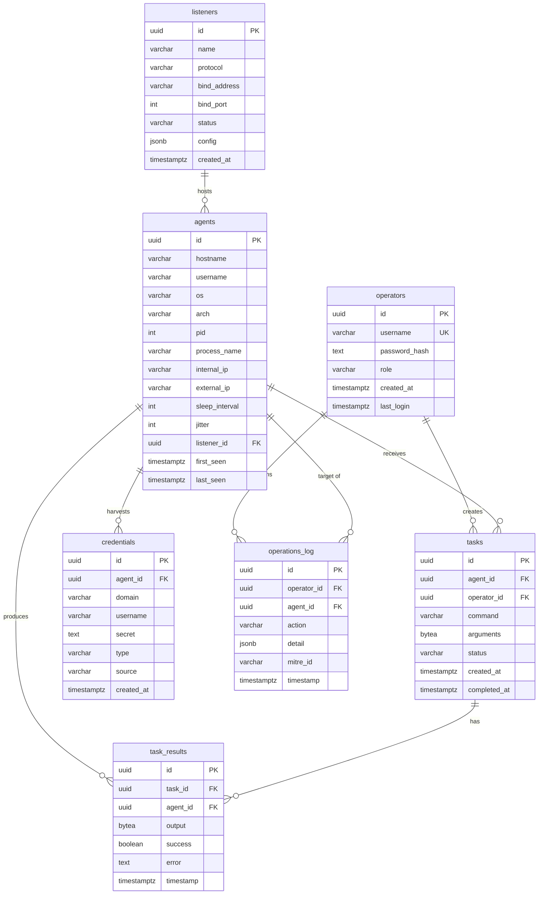
```mermaid
erDiagram
    operators {
        uuid id PK
        varchar username UK
        text password_hash
        varchar role
        timestamptz created_at
        timestamptz last_login
    }

    listeners {
        uuid id PK
        varchar name
        varchar protocol
        varchar bind_address
        int bind_port
        varchar status
        jsonb config
        timestamptz created_at
    }

    agents {
        uuid id PK
        varchar hostname
        varchar username
        varchar os
        varchar arch
        int pid
        varchar process_name
        varchar internal_ip
        varchar external_ip
        int sleep_interval
        int jitter
        uuid listener_id FK
        timestamptz first_seen
        timestamptz last_seen
    }

    tasks {
        uuid id PK
        uuid agent_id FK
        uuid operator_id FK
        varchar command
        bytea arguments
        varchar status
        timestamptz created_at
        timestamptz completed_at
    }

    task_results {
        uuid id PK
        uuid task_id FK
        uuid agent_id FK
        bytea output
        boolean success
        text error
        timestamptz timestamp
    }

    credentials {
        uuid id PK
        uuid agent_id FK
        varchar domain
        varchar username
        text secret
        varchar type
        varchar source
        timestamptz created_at
    }

    operations_log {
        uuid id PK
        uuid operator_id FK
        uuid agent_id FK
        varchar action
        jsonb detail
        varchar mitre_id
        timestamptz timestamp
    }

    operators ||--o{ tasks : "creates"
    operators ||--o{ operations_log : "performs"
    listeners ||--o{ agents : "hosts"
    agents ||--o{ tasks : "receives"
    agents ||--o{ task_results : "produces"
    agents ||--o{ credentials : "harvests"
    agents ||--o{ operations_log : "target of"
    tasks ||--o{ task_results : "has"
```

---

## SSE Event Flow

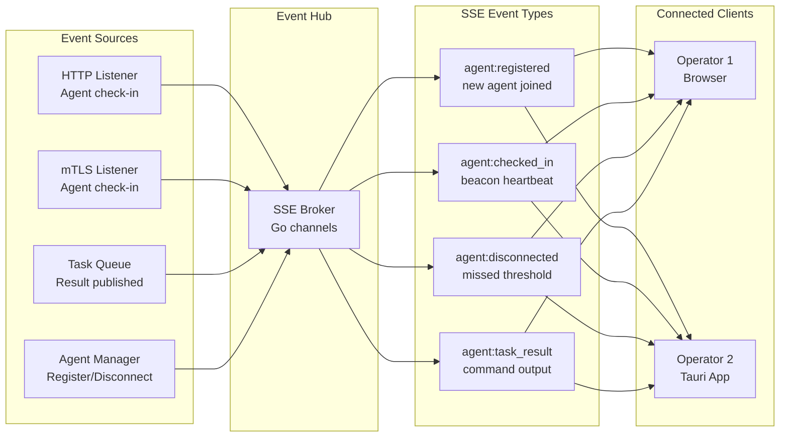
```mermaid
flowchart LR
    subgraph SOURCES["Event Sources"]
        HTTP_LIS["HTTP Listener\nAgent check-in"]
        MTLS_LIS["mTLS Listener\nAgent check-in"]
        TQ["Task Queue\nResult published"]
        MGR["Agent Manager\nRegister/Disconnect"]
    end

    subgraph HUB["Event Hub"]
        EVT["SSE Broker\nGo channels"]
    end

    subgraph EVENTS["SSE Event Types"]
        E1["agent:registered\nnew agent joined"]
        E2["agent:checked_in\nbeacon heartbeat"]
        E3["agent:disconnected\nmissed threshold"]
        E4["agent:task_result\ncommand output"]
    end

    subgraph CLIENTS["Connected Clients"]
        C1["Operator 1\nBrowser"]
        C2["Operator 2\nTauri App"]
    end

    HTTP_LIS --> EVT
    MTLS_LIS --> EVT
    TQ --> EVT
    MGR --> EVT
    EVT --> E1
    EVT --> E2
    EVT --> E3
    EVT --> E4
    E1 --> C1
    E1 --> C2
    E2 --> C1
    E2 --> C2
    E3 --> C1
    E3 --> C2
    E4 --> C1
    E4 --> C2
```

---

## Evasion Techniques Diagram

Platform-specific evasion suites with builder compile flag mappings.

```mermaid
flowchart TB
    subgraph WIN_EVASION["Windows Evasion Suite"]
        direction TB
        subgraph WIN_STARTUP["Startup Evasion"]
            direction LR
            UNHOOK["ntdll Unhook\nMap clean ntdll from disk\nOverwrite .text section\nRemoves EDR inline hooks"]
            ETW["ETW Patch\nPatch EtwEventWrite\n0x33 0xC0 0xC3\nxor eax,eax / ret"]
            AMSI["AMSI Patch\nPatch AmsiScanBuffer\nmov eax,0x80070057 / ret\nReturns E_INVALIDARG"]
        end
        subgraph WIN_RUNTIME["Runtime Evasion"]
            direction LR
            SLEEP_ENC["Encrypted Sleep - Ekko\nSystemFunction032 XOR\nEncrypt image during sleep\nPer-sleep random key"]
            STR_ENC["String Encryption\nXOR obfuscation\nDecrypt at first use\nNo cleartext IOCs"]
            AES["AES-256-CBC (CNG)\nBCryptGenRandom\nSession key support"]
        end
    end

    subgraph LIN_EVASION["Linux Evasion Suite"]
        direction TB
        subgraph LIN_ANTI["Anti-Analysis"]
            direction LR
            LIN_PTRACE["ptrace TRACEME\nDetect attached debugger\nPTRACE_DETACH self"]
            LIN_TRACER["TracerPid Check\nRead /proc/self/status\nExit if traced"]
            LIN_SANDBOX["Sandbox Detection\nCPU count check\nMemory size check\nUptime check"]
        end
        subgraph LIN_STEALTH["Stealth"]
            direction LR
            LIN_PROCMASK["Process Masking\nprctl PR_SET_NAME\nOverwrite argv[0]\nBlend with kworker"]
            LIN_SELFDELETE["Self-Delete\nreadlink /proc/self/exe\nunlink binary on disk"]
            LIN_LDCLEAN["LD_PRELOAD Cleanup\nunsetenv LD_PRELOAD\nunsetenv LD_AUDIT"]
            LIN_TIMESTOMP["Timestomp\nutimensat to past date\nEvade timeline forensics"]
        end
    end

    subgraph MAC_EVASION["macOS Evasion Suite"]
        direction TB
        subgraph MAC_ANTI["Anti-Analysis"]
            direction LR
            MAC_DENY["PT_DENY_ATTACH\nPrevent debugger attach\nUsed by Apple apps"]
            MAC_SYSCTL["sysctl P_TRACED\nQuery kernel for\ndebugger flag"]
            MAC_SANDBOX_M["Sandbox Detection\nCPU + Memory check\nvia sysctl"]
        end
        subgraph MAC_STEALTH["Stealth + Persistence"]
            direction LR
            MAC_CMDLINE["argv[0] Masking\nOverwrite in memory\nFool ps + Activity Monitor"]
            MAC_SELFDELETE_M["Self-Delete\n_NSGetExecutablePath\nrealpath + unlink"]
            MAC_DYLD["DYLD Cleanup\nunsetenv DYLD_INSERT_LIBRARIES\nunsetenv DYLD_PRINT_LIBRARIES"]
            MAC_PERSIST["LaunchAgent Persistence\nWrite plist to\n~/Library/LaunchAgents/\nRunAtLoad + KeepAlive"]
        end
    end

    subgraph WIN_FLAGS["Windows Builder Flags"]
        WF1["ENABLE_UNHOOK=1"]
        WF2["ENABLE_ETW_PATCH=1"]
        WF3["ENABLE_AMSI_PATCH=1"]
        WF4["ENABLE_SLEEP_ENCRYPT=1"]
    end

    subgraph POSIX_FLAGS["POSIX Builder Flags"]
        PF1["ENABLE_ANTI_DEBUG=1"]
        PF2["ENABLE_PROC_MASK=1"]
        PF3["ENABLE_SELF_DELETE=0"]
        PF4["ENABLE_ENV_CLEAN=1"]
        PF5["ENABLE_SANDBOX_CHECK=1"]
    end

    WF1 -.->|"controls"| UNHOOK
    WF2 -.->|"controls"| ETW
    WF3 -.->|"controls"| AMSI
    WF4 -.->|"controls"| SLEEP_ENC

    PF1 -.->|"controls"| LIN_PTRACE
    PF1 -.->|"controls"| MAC_DENY
    PF2 -.->|"controls"| LIN_PROCMASK
    PF2 -.->|"controls"| MAC_CMDLINE
    PF3 -.->|"controls"| LIN_SELFDELETE
    PF3 -.->|"controls"| MAC_SELFDELETE_M
    PF4 -.->|"controls"| LIN_LDCLEAN
    PF4 -.->|"controls"| MAC_DYLD
    PF5 -.->|"controls"| LIN_SANDBOX
    PF5 -.->|"controls"| MAC_SANDBOX_M
```

---

## Trust Boundaries

For Microsoft Threat Modeling Tool, define these trust boundaries:

| ID | Boundary Name | Description | Components Inside |
|----|--------------|-------------|-------------------|
| TB1 | C2 Infrastructure | Operator-controlled systems | Team Server, PostgreSQL, Redis, Client, Profile Store |
| TB2 | Team Server Process | Go process boundary | All server-side processes (P1-P11) |
| TB3 | HTTP Transport | HTTP/HTTPS between server and agent | Agent-to-HTTP-listener data flows |
| TB4 | mTLS Transport | Mutual TLS between server and agent | Agent-to-mTLS-listener data flows, bidirectional cert verification |
| TB5 | Target Network | Compromised host network | Agent processes (Windows, Linux, macOS) |
| TB6 | Agent Process | Agent memory space | Evasion, BOF loader, token manipulation, command execution |
| TB7 | Database Layer | Data persistence boundary | PostgreSQL, Redis |
| TB8 | Browser/Tauri | Client application boundary | React UI, Zustand stores |
| TB9 | Profile Storage | C2 profile configuration boundary | profiles/*.yaml files |

### Trust Boundary Crossings

```mermaid
flowchart TB
    subgraph TB8["TB8: Client Application"]
        CLIENT["Operator Client"]
    end

    subgraph TB1["TB1: C2 Infrastructure"]
        subgraph TB2["TB2: Team Server Process"]
            API["HTTP API"]
            HTTP_LIS["HTTP Listener"]
            MTLS_LIS["mTLS Listener"]
            BUILDER["Builder"]
            PROF_H["Profile Handler"]
        end
        subgraph TB7["TB7: Database Layer"]
            PG[("PostgreSQL")]
            RD[("Redis")]
        end
        subgraph TB9["TB9: Profile Store"]
            PROFILES[("profiles/*.yaml")]
        end
    end

    subgraph TB5["TB5: Target Network"]
        subgraph TB6_WIN["TB6: Windows Agent"]
            WIN_AGT["Windows Agent\n+ Token Manipulation"]
        end
        subgraph TB6_LIN["TB6: Linux Agent"]
            LIN_AGT["Linux Agent"]
        end
        subgraph TB6_MAC["TB6: macOS Agent"]
            MAC_AGT["macOS Agent"]
        end
    end

    CLIENT -->|"TC1: JWT Auth\nREST over HTTPS"| API
    API -->|"TC2: SSE Events\nover HTTPS"| CLIENT
    WIN_AGT -->|"TC3: HTTP POST\nSysinfo + Results\nSpoofing risk"| HTTP_LIS
    HTTP_LIS -->|"TC4: HTTP Response\nTasks + Agent ID\nTampering risk"| WIN_AGT
    LIN_AGT -->|"TC5: HTTP POST\nNo TLS by default"| HTTP_LIS
    MAC_AGT -->|"TC6: HTTP POST\nNo TLS by default"| HTTP_LIS
    WIN_AGT -->|"TC7: mTLS POST\nMutual cert auth\nStronger identity"| MTLS_LIS
    LIN_AGT -->|"TC8: mTLS POST\nMutual cert auth"| MTLS_LIS
    API -->|"TC9: SQL/Redis\nInjection risk"| PG
    API -->|"TC10: Queue ops"| RD
    PROF_H -->|"TC11: Read/Write\nYAML parse risk"| PROFILES

    style TB8 fill:#1a3a5c,stroke:#4a9eff
    style TB1 fill:#1a3a2c,stroke:#4aff9e
    style TB2 fill:#2a4a3c,stroke:#5affae
    style TB7 fill:#3a2a1c,stroke:#ffaa4a
    style TB9 fill:#2a2a3c,stroke:#aa88ff
    style TB5 fill:#3a1a1a,stroke:#ff4a4a
    style TB6_WIN fill:#4a2a2a,stroke:#ff6a6a
    style TB6_LIN fill:#4a2a2a,stroke:#ff6a6a
    style TB6_MAC fill:#4a2a2a,stroke:#ff6a6a
```

---

## Data Store Inventory

| ID | Name | Technology | Data Stored | Access |
|----|------|-----------|-------------|--------|
| DS1 | PostgreSQL | PostgreSQL 16 | operators, listeners, agents, tasks, task_results, credentials, operations_log | Team Server via pgx pool |
| DS2 | Redis | Redis 7 | Task queues `apex:tasks:{agentID}`, pub/sub channels `apex:results:{agentID}` | Team Server via go-redis |
| DS3 | Agent Source (Windows) | Filesystem | main.c, evasion.h, bof.h, crypto.h, token.h, Makefile | Builder process |
| DS4 | Agent Source (POSIX) | Filesystem | agent_posix.c, evasion_linux.h, evasion_macos.h, Makefile | Builder process |
| DS5 | BOF Storage | Filesystem `data/bofs/` | Uploaded .o/.obj COFF object files | Payload Handler |
| DS6 | Profile Storage | Filesystem `profiles/` | Malleable C2 profile YAML files (default, amazon, cloudflare, github, google, microsoft, slack) | Profile Handler |
| DS7 | TLS Certificates | Filesystem | Server certs, client certs, CA cert for mTLS listener | mTLS Listener |

---

## Process Inventory

| ID | Name | Technology | Input Data | Output Data | Trust Level |
|----|------|-----------|------------|-------------|-------------|
| P1 | HTTP API Router | Go, Chi v5 | REST requests | JSON responses | High |
| P2 | Auth Service | Go, JWT, bcrypt | Credentials | JWT tokens | High |
| P3 | Task Handler | Go | Create task req | Task records | High |
| P4 | Task Queue | Go, Redis | Enqueue/dequeue | Tasks, results | High |
| P5 | Event Hub | Go, SSE | Events | SSE stream | High |
| P6 | HTTP/HTTPS Listener | Go, net/http | Agent POSTs | Task responses | Medium |
| P7 | mTLS Listener | Go, crypto/tls | Agent POSTs + client certs | Task responses | Medium-High |
| P8 | Agent Manager | Go, pgx | Sysinfo, check-ins | Agent records | High |
| P9 | Payload Builder | Go, exec | Build config + platform | Compiled binary (PE/ELF/Mach-O) | High |
| P10 | Profile Handler | Go | YAML upload/list/delete | Profile data | High |
| P11 | Terminal Page | React, TS | User commands | API calls | Medium |
| PA1 | Windows Evasion Module | C | Config flags | Patched memory (ntdll, ETW, AMSI) | Low |
| PA2 | Windows Beacon Loop | C, WinHTTP | Server responses | HTTP requests | Low |
| PA3 | Windows Command Executor | C | Task commands | Command output | Low |
| PA4 | BOF Loader | C | COFF data | Execution output | Low |
| PA5 | Token Manipulation | C, advapi32 | PID or credentials | Impersonation token | Low |
| PA6 | POSIX Beacon Loop | C, raw sockets | Server responses | HTTP requests | Low |
| PA7 | POSIX Command Executor | C, fork/exec | Task commands | Command output | Low |
| PA8 | Linux Evasion Module | C | Config flags | Process masking, anti-debug | Low |
| PA9 | macOS Evasion Module | C | Config flags | PT_DENY_ATTACH, env cleanup | Low |

---

## External Entity Inventory

| ID | Name | Description | Trust Level | Interactions |
|----|------|-------------|-------------|--------------|
| EE1 | Operator | Red team operator using Tauri/React client | Trusted | REST API, SSE |
| EE2 | Windows Target Host | Windows machine running agent.exe (PE) | Untrusted | HTTP/HTTPS/mTLS beacon |
| EE3 | Linux Target Host | Linux machine running agent_linux (ELF) | Untrusted | HTTP/mTLS beacon |
| EE4 | macOS Target Host | macOS machine running agent_macos (Mach-O) | Untrusted | HTTP beacon |
| EE5 | MinGW Compiler | x86_64-w64-mingw32-gcc cross-compiler for Windows builds | Trusted (local) | exec from builder |
| EE6 | GCC Compiler | Native GCC for Linux builds | Trusted (local) | exec from builder |
| EE7 | osxcross/clang Compiler | o64-clang (osxcross) or clang for macOS builds | Trusted (local) | exec from builder |
| EE8 | Domain Controller | Active Directory DC in target network | Untrusted | Lateral movement via token manipulation |

---

## Data Flow Inventory

Complete list of data flows for Microsoft Threat Modeling Tool:

| ID | Source | Destination | Protocol | Data | Auth | Encrypted |
|----|--------|-------------|----------|------|------|-----------|
| DF1 | Client | API Router | HTTPS | REST requests + JWT | JWT Bearer | TLS optional |
| DF2 | API Router | Client | HTTPS | JSON responses | Session | TLS optional |
| DF3 | API Router | Client | SSE | Real-time events | JWT query | TLS optional |
| DF4 | Windows Agent | HTTP Listener | HTTP/S | Registration sysinfo | None | TLS optional |
| DF5 | HTTP Listener | Windows Agent | HTTP/S | Agent ID + tasks | None | TLS optional |
| DF6 | Linux Agent | HTTP Listener | HTTP | Registration sysinfo | None | No |
| DF7 | HTTP Listener | Linux Agent | HTTP | Agent ID + tasks | None | No |
| DF8 | macOS Agent | HTTP Listener | HTTP | Registration sysinfo | None | No |
| DF9 | HTTP Listener | macOS Agent | HTTP | Agent ID + tasks | None | No |
| DF10 | Agent (any) | mTLS Listener | mTLS | Registration + results | Client cert | TLS 1.2+ |
| DF11 | mTLS Listener | Agent (any) | mTLS | Agent ID + tasks | Server cert | TLS 1.2+ |
| DF12 | Agent (any) | HTTP Listener | HTTP/S | Check-in + results | X-Agent-ID | TLS optional |
| DF13 | HTTP Listener | Agent (any) | HTTP/S | Task payloads | None | TLS optional |
| DF14 | Task Handler | Redis | TCP | Task JSON RPUSH | None | No |
| DF15 | Listener | Redis | TCP | Dequeue LPOP | None | No |
| DF16 | Redis | Listener | TCP | Task data | None | No |
| DF17 | Listener | Redis | TCP | Result PUBLISH | None | No |
| DF18 | Agent Manager | PostgreSQL | TCP | Agent INSERT/UPDATE | Password | No |
| DF19 | Auth Service | PostgreSQL | TCP | Operator SELECT | Password | No |
| DF20 | Agent Manager | Event Hub | Internal | Agent events | N/A | N/A |
| DF21 | Builder | Source FS | Filesystem | Read source, write binary | OS perms | N/A |
| DF22 | Builder | MinGW/GCC/clang | exec | Compile command + flags | N/A | N/A |
| DF23 | Client | Builder | HTTPS | Build config + platform | JWT | TLS optional |
| DF24 | Builder | Client | HTTPS | Binary base64 | JWT | TLS optional |
| DF25 | Client | BOF Store | HTTPS to FS | BOF upload | JWT | TLS optional |
| DF26 | BOF Store | Client | FS to HTTPS | BOF listing | JWT | TLS optional |
| DF27 | Client | Profile Handler | HTTPS | Profile upload YAML | JWT | TLS optional |
| DF28 | Profile Handler | Profile Store | Filesystem | Write/read YAML | OS perms | N/A |
| DF29 | Profile Store | Client | FS to HTTPS | Profile listing | JWT | TLS optional |
| DF30 | Windows Agent | Windows Kernel | Win32 API | Token steal/make/revert | Process token | N/A |
| DF31 | mTLS Listener | CA Cert Store | Filesystem | CA cert for client validation | N/A | N/A |

---

## STRIDE Threat Mapping

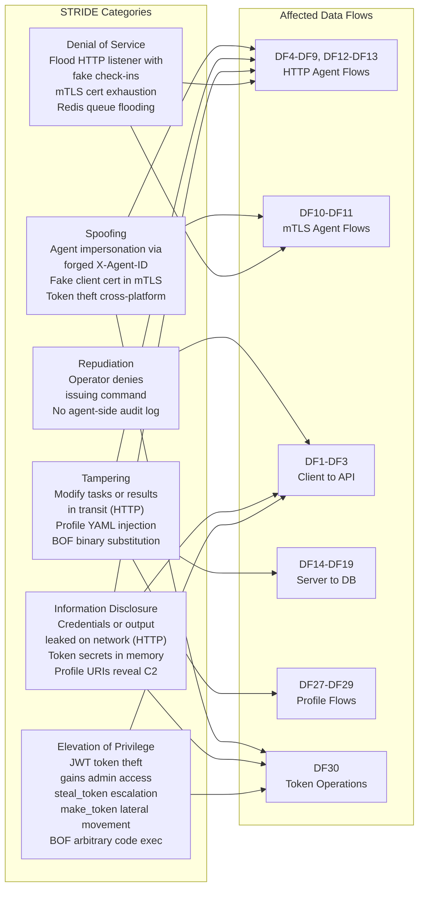
```mermaid
flowchart LR
    subgraph STRIDE["STRIDE Categories"]
        direction TB
        S["Spoofing\nAgent impersonation via\nforged X-Agent-ID\nFake client cert in mTLS\nToken theft cross-platform"]
        T["Tampering\nModify tasks or results\nin transit (HTTP)\nProfile YAML injection\nBOF binary substitution"]
        R["Repudiation\nOperator denies\nissuing command\nNo agent-side audit log"]
        I["Information Disclosure\nCredentials or output\nleaked on network (HTTP)\nToken secrets in memory\nProfile URIs reveal C2"]
        D["Denial of Service\nFlood HTTP listener with\nfake check-ins\nmTLS cert exhaustion\nRedis queue flooding"]
        E["Elevation of Privilege\nJWT token theft\ngains admin access\nsteal_token escalation\nmake_token lateral movement\nBOF arbitrary code exec"]
    end

    subgraph FLOWS["Affected Data Flows"]
        F_HTTP["DF4-DF9, DF12-DF13\nHTTP Agent Flows"]
        F_MTLS["DF10-DF11\nmTLS Agent Flows"]
        F_API["DF1-DF3\nClient to API"]
        F_DB["DF14-DF19\nServer to DB"]
        F_PROFILE["DF27-DF29\nProfile Flows"]
        F_TOKEN["DF30\nToken Operations"]
    end

    S --> F_HTTP
    S --> F_MTLS
    S --> F_TOKEN
    T --> F_HTTP
    T --> F_DB
    T --> F_PROFILE
    R --> F_API
    I --> F_HTTP
    I --> F_API
    I --> F_TOKEN
    D --> F_HTTP
    D --> F_MTLS
    E --> F_API
    E --> F_TOKEN
```

---

## Credential Auto-Capture Flow

Shows how credentials are automatically extracted from agent task output and stored in the vault.

```mermaid
sequenceDiagram
    participant Agent as Agent (Target)
    participant Listener as HTTP Listener
    participant Vault as Credential Vault
    participant DB as PostgreSQL
    participant UI as Operator Client

    Agent->>Listener: POST /check-in (task results)
    Listener->>Listener: base64 decode output
    Listener->>Vault: ParseOutput(agentID, output)
    
    Note over Vault: Regex matching:<br/>SAM: user:rid:lm:ntlm:::<br/>NTLM: DOMAIN\user:hash<br/>Plaintext: Username: X Password: Y

    alt Credentials found
        Vault->>DB: INSERT INTO credentials
        Vault->>Listener: log "Credential captured"
    end
    
    Listener->>UI: SSE agent:task_result
    UI->>UI: Display result in terminal

    Note over UI: Credentials page fetches<br/>GET /api/credentials<br/>Shows type-coded table
```

---

## Agent Collection Modules

Architecture of the agent-side collection capabilities (screenshot, keylogger, port scanner).

```mermaid
flowchart TB
    subgraph WIN["Windows Agent Modules"]
        SS_W["screenshot.h<br/>GDI BitBlt → BMP<br/>Scaled to 640px<br/>base64 encoded"]
        KL["keylogger.h<br/>WH_KEYBOARD_LL hook<br/>Background thread<br/>start/stop/dump"]
        PS_W["portscan.h<br/>TCP connect scan<br/>Winsock2 select()<br/>CIDR + port ranges"]
    end

    subgraph POSIX["POSIX Agent Modules"]
        SS_P["screenshot (posix)<br/>scrot / import fallback<br/>Read temp file<br/>base64 encoded"]
        PS_P["portscan.h<br/>TCP connect scan<br/>poll() non-blocking<br/>CIDR + port ranges"]
    end

    subgraph SERVER["Team Server Processing"]
        BMP["BMP Detection<br/>Check magic bytes 'BM'<br/>Save to data/screenshots/<br/>Replace output with path"]
        CRED["Credential Parser<br/>SAM hash regex<br/>NTLM hash regex<br/>Plaintext pair regex"]
    end

    SS_W -->|base64 BMP| BMP
    SS_P -->|base64 BMP| BMP
    KL -->|base64 text| CRED
    PS_W -->|base64 text| CRED
    PS_P -->|base64 text| CRED
```

---

## BOF Template Library

Organization of the Beacon Object File templates by category.

```mermaid
flowchart LR
    subgraph BOF["BOF Library (bofs/)"]
        direction TB
        API["bof_api.h<br/>BeaconAPI declarations<br/>datap struct<br/>CALLBACK constants"]
        
        subgraph LAT["lateral/"]
            PSEXEC["psexec.c<br/>T1021.002<br/>SCM service creation"]
            SCSHELL["scshell.c<br/>T1543.003<br/>Service binary hijack"]
            WMIEXEC["wmiexec.c<br/>T1047<br/>WMI COM execution"]
        end

        subgraph RECON["recon/"]
            NETVIEW["netview.c<br/>T1135<br/>NetShareEnum"]
            WHOAMI["whoami_bof.c<br/>T1033<br/>Token interrogation"]
        end

        subgraph PERSIST["persist/"]
            SCHTASK["schtask.c<br/>T1053.005<br/>Scheduled tasks"]
            REGRUN["registry_run.c<br/>T1547.001<br/>Run key persistence"]
        end
    end

    API --> LAT
    API --> RECON
    API --> PERSIST
```

---

## Operator Client Page Architecture

```mermaid
flowchart TB
    subgraph CLIENT["Operator Client (Tauri + React)"]
        direction TB
        DASH["Dashboard<br/>Agent count, listener health"]
        LIST["Listeners<br/>Create/start/stop"]
        AGENT["Agents<br/>Live table with status"]
        TERM["Terminal<br/>Per-agent interactive shell"]
        BUILD["Agent Builder<br/>Win/Linux/macOS tabs"]
        MOD["Modules<br/>BOF + profiles"]
        CRED_UI["Credentials<br/>Auto-captured vault<br/>Type badges, search"]
        FB["File Browser<br/>Breadcrumb nav<br/>Upload/download"]
        PT["Process Tree<br/>Expandable hierarchy<br/>Search, kill"]
        GRAPH["Attack Graph<br/>OS icons, stats<br/>Double-click interact"]
        MITRE["MITRE ATT&CK<br/>Tabbed matrix/timeline"]
        SET["Settings<br/>Server config"]
    end

    subgraph STORES["Zustand Stores"]
        AS["agentStore"]
        LS["listenerStore"]
        TRS["taskResultStore"]
        TS["terminalStore"]
        MS["mitreStore"]
        OS_["opsecStore"]
        AUTH["authStore"]
    end

    CRED_UI -->|GET/POST/DELETE| API_CRED["/api/credentials"]
    FB -->|taskService| TERM
    PT -->|taskService| TERM
    GRAPH -->|double-click| TERM
```

---

## Microsoft Threat Modeling Tool Elements

Summary for recreating in Microsoft TMT:

**External Entities (Interactors):**
- Operator Client - Tauri/React desktop app (trusted)
- Windows Target Host - Windows C implant with PE output, BOF + token manipulation + keylogger + screenshot (untrusted)
- Linux Target Host - POSIX C implant with ELF output + screenshot + portscan (untrusted)
- macOS Target Host - POSIX C implant with Mach-O output + screenshot + portscan (untrusted)
- MinGW Compiler - Windows cross-compiler (trusted, local)
- GCC Compiler - Linux native compiler (trusted, local)
- osxcross/clang Compiler - macOS cross-compiler (trusted, local)
- Domain Controller - AD target for lateral movement (untrusted)

**Processes:**
- HTTP API Router, Auth Service, Task Handler, Task Queue, Event Hub, HTTP/HTTPS Listener, mTLS Listener, Agent Manager, Multi-Platform Payload Builder, Profile Handler, Credential Handler, Credential Vault (auto-parser)
- Agent-side: Windows Evasion Module, POSIX Evasion (Linux/macOS), Beacon Loop (WinHTTP / raw TCP / OpenSSL TLS), Command Executor, BOF Loader (Windows only), Token Manipulation (Windows only), Keylogger (Windows), Screenshot (Windows GDI / POSIX scrot), Port Scanner (cross-platform)

**Data Stores:**
- PostgreSQL (agents, tasks, credentials, operators, operations_log), Redis (task queue + pub/sub), Agent Source - Windows (filesystem), Agent Source - POSIX (filesystem), BOF Storage (filesystem), BOF Templates (bofs/lateral, bofs/recon, bofs/persist), Profile Storage (filesystem), TLS Certificates (filesystem), Screenshot Storage (data/screenshots/)

**Trust Boundaries:**
- C2 Infrastructure, Team Server Process, HTTP Transport, mTLS Transport, Target Network, Agent Process, Database Layer, Client Application, Profile Storage, Screenshot Storage

**Data Flows:**
- 35+ flows as documented in the Data Flow Inventory table above
- Each with source, destination, protocol, data content, auth method, encryption status
- Key additions: credential auto-capture flows (DF32-DF34), screenshot save flow (DF35), multi-task batch flow, OpenSSL TLS for POSIX agents

---

*Updated for Apex C2 Framework. All Mermaid diagrams render natively on GitHub without HTML dependencies.*
